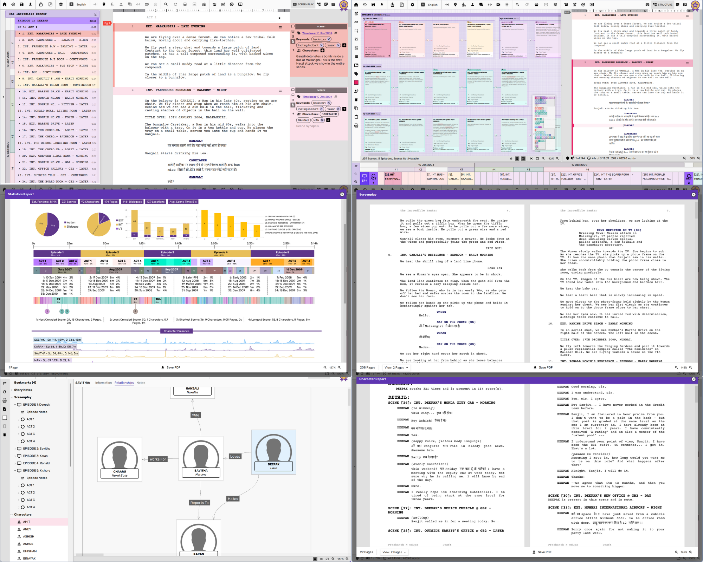

# Scrite

Scrite is an open-source desktop screenwriting app. Its an offline app, with no 
built-in cloud syncing. You can find more information on our [official website](https://www.scrite.io).

## Features
- Create screenplays and format elements appropriately.
- Type in multiple Indian and International languages.
- Import screenplays from FinalDraft and HTML formats.
- Export screenplays to PDF, FinalDraft, Text and HTML formats.
- Generate Character and Location Reports
- Capture character and scene notes.

## Building from source
Scrite is developed using Qt 5.15.19. To build scrite, simply install
this version of Qt on your computer (Windows, macOS or Linux).

Open `scrite.pro` in Qt Creator and build.

## Reporting Issues
If you run into bugs, crashes or find missing features OR features that
are not working as expected, we recommend that you post a message on
our Discord server, discuss it with us there before creating a bug
ticket on GitHub.

Here is a link to our Discord server: https://discord.gg/bGHquFX5jK

## Conference Talks based on Scrite
These talks may help you find your way around the code.

- Solving Problems for Yourself, and Accidentally Thousands More - [IndiaFOSS 2025](https://www.youtube.com/watch?v=_wbqbblIexY)
- Closing The Gaps - QML on the Desktop - [Qt DevCon 2022](https://youtu.be/tyn90zQZTEg)
- Building Beautiful Desktop Apps Using QML - [Qt DevDes Days 2021](https://youtu.be/zQAGs8cuGv8)
- Insights from Building Scrite Using QML - [Qt Desktop Days 2020](https://youtu.be/z7GEUrRyh0U)

## Tutorials and Walkthoughs

- [Guided Tour of Scrite, Sep 2022](https://youtu.be/Web6WEj56wo)
- [Generating the Statistics Report](https://youtu.be/qp8ZSYI8Z_w)
- [Using Custom Story Beats](https://youtu.be/Ql_BjMVpjNc)
- [Typing in Multiple Indian Languages](https://youtu.be/Ts1PFvemaIw)

## Reviews

- [ScreenwritingScribe reviews Scrite, Jan 2025](https://www.youtube.com/watch?v=8PXrQ6DUw9o)
- [Sarvana from Film Psychology reviews Scrite, in Tamil](https://www.youtube.com/watch?v=ipWjr_33iIk)
- [Rahul, Pooja of Paramvah Studios talks about their Film and Scrite](https://youtu.be/niG2X6nCYCA)
- [Nhân Trương reviews Scrite, in Vietnamese](https://www.youtube.com/watch?v=oY4kQrzIgvU)
- [James K Martin reviews Scrite](https://www.youtube.com/watch?v=_JkTx75oVbE)

## Dependencies

### mkdocs
If you want to generate documentation from the docs folder, you will also need
to install Python and mkdocs.

Once you have python and pip installed,

> pip install mkdocs mkdocs-material mkdocs-video

Further reading: https://www.mkdocs.org/user-guide/installation/

### Qt
We use a commercial license of Qt 5.15.19 for all production and beta builds. 
You should be able to use any available Qt 5.15 LTS for building Scrite. The
code is organized to work well with our webservices in production, so if you 
build from the source code here - it may not work with our production servers.
You should be able to comment away all references to our webservices and 
construct a purely open-source build. At some point, we will introduce compile
time config settings to make this easy.

### Windows
Ensure that you have OpenSSL 1.1.1 installed. The app is unlikely to work with 
any other version of OpenSSL.

We use Windows 11 for development, although we know that the app works on Windows
10 as well. Any previous version of Windows, we are not sure.

### macOS
Any version of macOS supported by Qt 5.15 LTS should work.

### Linux
To build the app on Linux, there are a couple of dependencies to take care of
first.

#### Hunspell (for spellcheck)
To build Scrite with Hunspell support on Linux, please install hunspell-dev
On Ubuntu, you can do this by executing the following command

> sudo apt-get install libhunspell-dev

Depending on the version number of hunspell installed on your computer, you
will have to update config-hunspell.h. Comments in this file should help you
understand what changes you should be making.

For more information about this package, please visit
https://packages.debian.org/sid/libhunspell-dev

#### xcb and xinerama
Make sure that you have cursor, xinerama installed

> sudo apt install libxcb-cursor0 libxcb-xinerama0

#### OpenSSL
You will also need OpenSSL version 1.1.1

> sudo add-apt-repository ppa:nrbrtx/libssl1 -y
> sudo apt update
> sudo apt install libssl1.1 libssl-dev=1.1.1*

#### imagemagick
For running the package scripts, you will need imagemagick and linuxdeployqt

> sudo apt install imagemagick

#### linuxdeployqt (for packaging)
> wget -c https://github.com/probonopd/linuxdeployqt/releases/download/continuous/linuxdeployqt-continuous-x86_64.AppImage

#### lib-ibus-1.0 for Language support
Language support on Linux requirres IBUS.

> sudo apt install ibus ibus-m17n libibus-1.0-dev

Additionally, ensure that ibus daemon is running and that you setup languages using

> ibus-setup

You may also need to include the following lines into environment variables.

export GTK_IM_MODULE=ibus
export XMODIFIERS=@im=ibus
export QT_IM_MODULE=ibus
export XIM_PROGRAM="/usr/bin/ibus-daemon -drx"

## Screenshots

