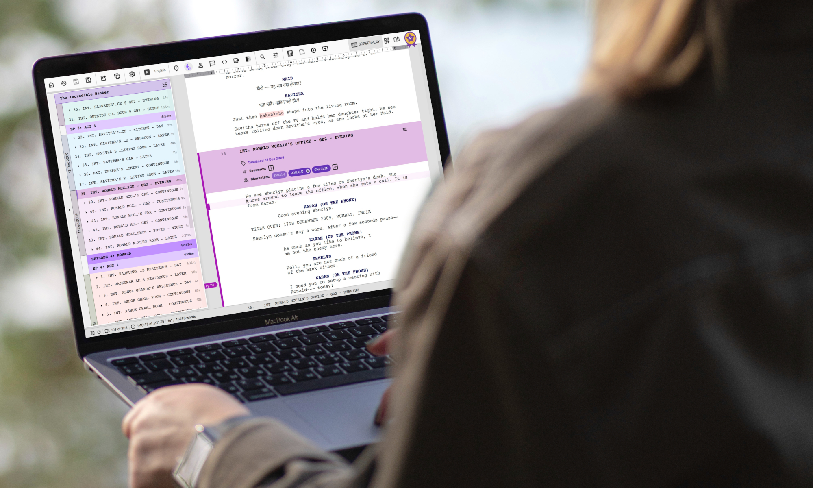
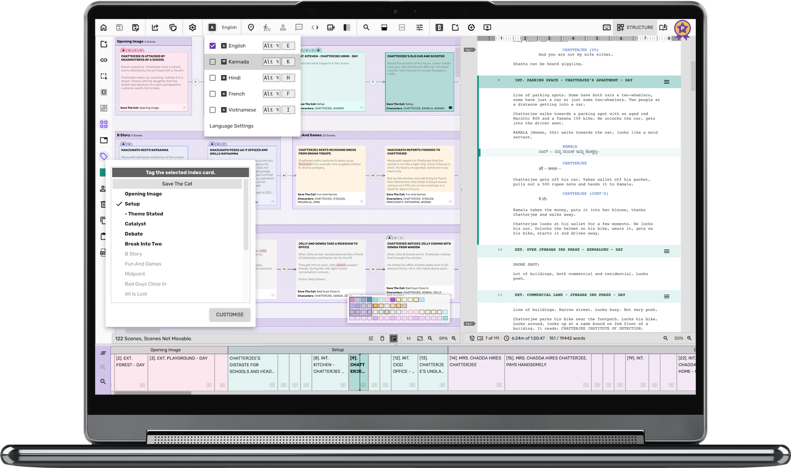

# Scrite

Scrite is an open-source desktop screenwriting app. Its an offline app, with no built-in cloud
syncing. You can find more information on our [official website](https://www.scrite.io).

## Features
- Create screenplays and format elements appropriately.
- Type in multiple Indian and International languages.
- Import screenplays from FinalDraft and HTML formats.
- Export screenplays to PDF, FinalDraft, Text and HTML formats.
- Generate Character and Location Reports
- Capture character and scene notes.

A complete user guide can be found [here](https://www.scrite.io/docs/userguide).

## Reporting Issues
If you run into bugs, crashes or find missing features OR features that are not working as expected,
we recommend that you post a message on our Discord server, discuss it with us there before creating
a bug ticket on GitHub.

Here is a link to our Discord server: https://discord.gg/bGHquFX5jK

## Conference Talks based on Scrite
These talks may help you find your way around the code.

- Solving Problems for Yourself, and Accidentally Thousands More - [IndiaFOSS
  2025](https://www.youtube.com/watch?v=2O9A4HRlJAY)
- Closing The Gaps - QML on the Desktop - [Qt DevCon 2022](https://youtu.be/tyn90zQZTEg)
- Building Beautiful Desktop Apps Using QML - [Qt DevDes Days 2021](https://youtu.be/zQAGs8cuGv8)
- Insights from Building Scrite Using QML - [Qt Desktop Days 2020](https://youtu.be/z7GEUrRyh0U)

## Tutorials and Walkthoughs

- [Guided Tour of Scrite, Sep 2022](https://youtu.be/Web6WEj56wo)
- [Generating the Statistics Report](https://youtu.be/qp8ZSYI8Z_w)
- [Using Custom Story Beats](https://youtu.be/Ql_BjMVpjNc)
- [Typing in Multiple Indian Languages](https://youtu.be/Ts1PFvemaIw)

## Reviews

- [ScreenwritingScribe reviews Scrite, Jan 2025](https://www.youtube.com/watch?v=8PXrQ6DUw9o)
- [Sarvana from Film Psychology reviews Scrite, in
  Tamil](https://www.youtube.com/watch?v=ipWjr_33iIk)
- [Rahul, Pooja of Paramvah Studios talk about their Film and Scrite](https://youtu.be/niG2X6nCYCA)
- [Nhân Trương reviews Scrite, in Vietnamese](https://www.youtube.com/watch?v=oY4kQrzIgvU)
- [James K Martin reviews Scrite](https://www.youtube.com/watch?v=_JkTx75oVbE)

## Special Thanks

[Grant Funding (2026)](https://www.scrite.io/fossunited-grants/): Covering essential expenses 
related to server hosting, software licensing, code signing certificates, and legal document 
reviews.

## Screenshots

