# Advanced Editing

## Typing in multiple languages

Scrite allows you to type in English and 10 other Indian Languages. As we progress, support for more languages will be added.

Scrite provides a built-in "almost phonetic" transliterator for Bengali, Gujarati, Hindi, Kannada, Malayalam, Oriya, Punjabi, Sanskrit, Tamil and Telugu. You can lookup the alphabet mapping tables within Scrite, if you face any difficulty with transliterating specific words. Some of our users have complained that they would like to make use of transliteration provided by macOS or Windows, with Scrite. Starting with 0.4.13, we provide simple ways to do just that.

### Switching languages in Scrite

To switch to a different languge, click on the language button in the toolbar and select a language you want to type in.

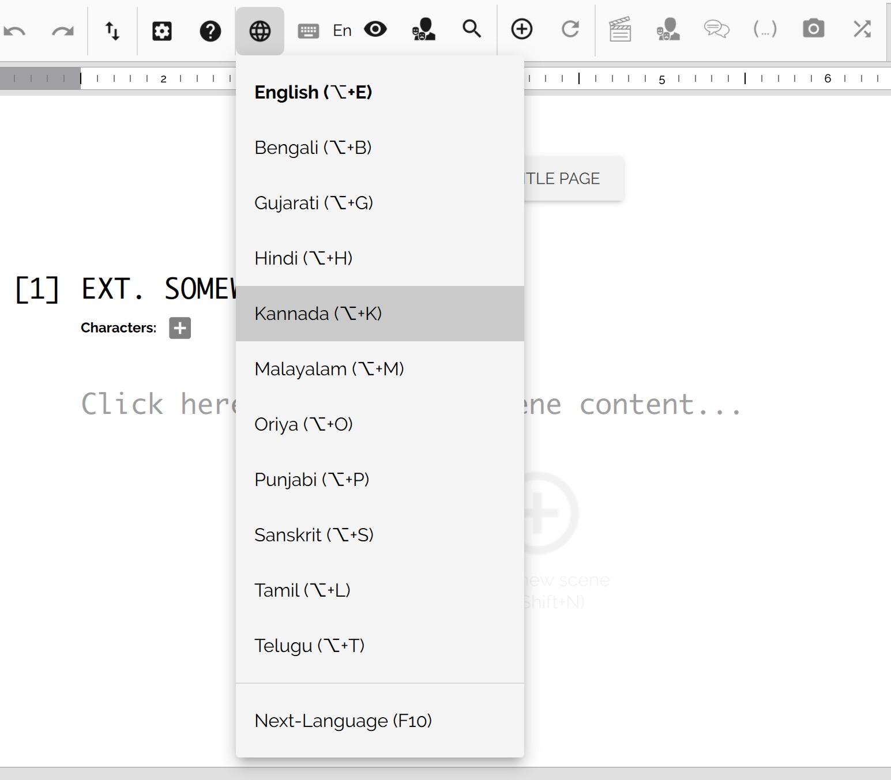

From this point onwards, you can type any word from the selected language in phonetic-English and Scrite transliterates it when you hit space or any punctuation mark.

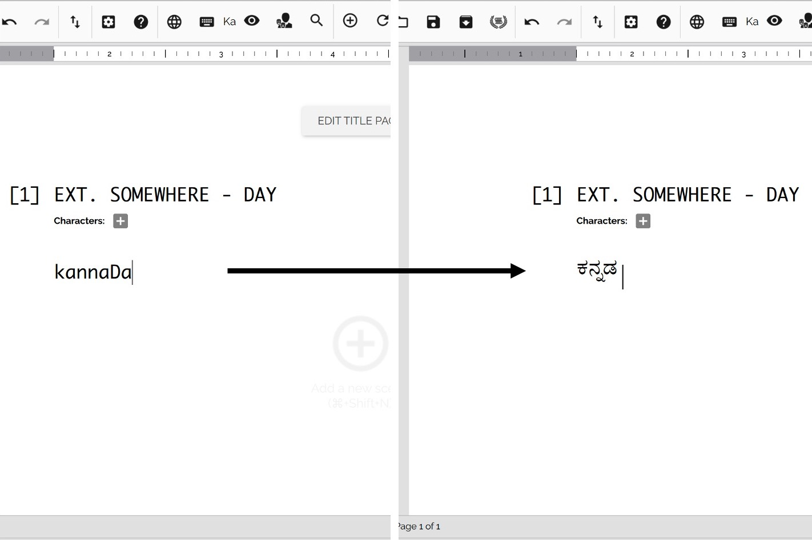

If your verson of phonetic-English is not getting transliterated properly, then you can lookup the alphabet mapping provided by Scrite and find out an appropriate way to write. For example, below we can see that the word Krishna is not properly translitated into Kannada. You would have to type kzrShNa to get proper results.

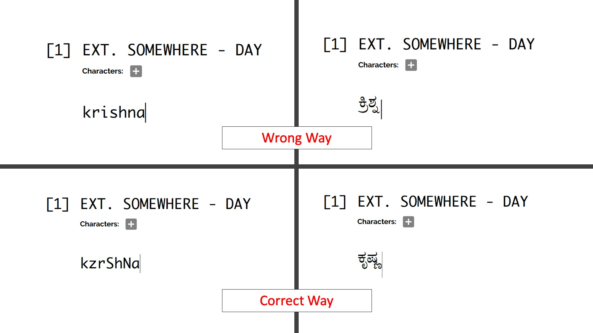

The alphabet mapping table can be easily pulled up by clicking on the keyboard icon in the toolbar.

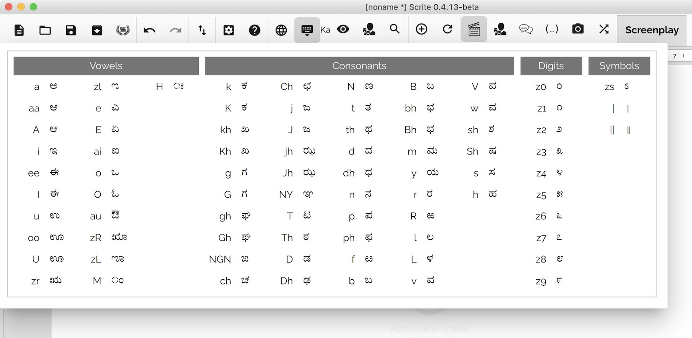

### Using your operating system's input method with Scrite

Starting with 0.4.13, you can add new input methods in your operating system and use it with Scrite easily. The subsections below explain how this can be done in macOS and Windows 10.

#### Mapping input sources on macOS

Open System Preferences > Keyboard > Input Sources in your macOS. Here you can add input sources of your choice.

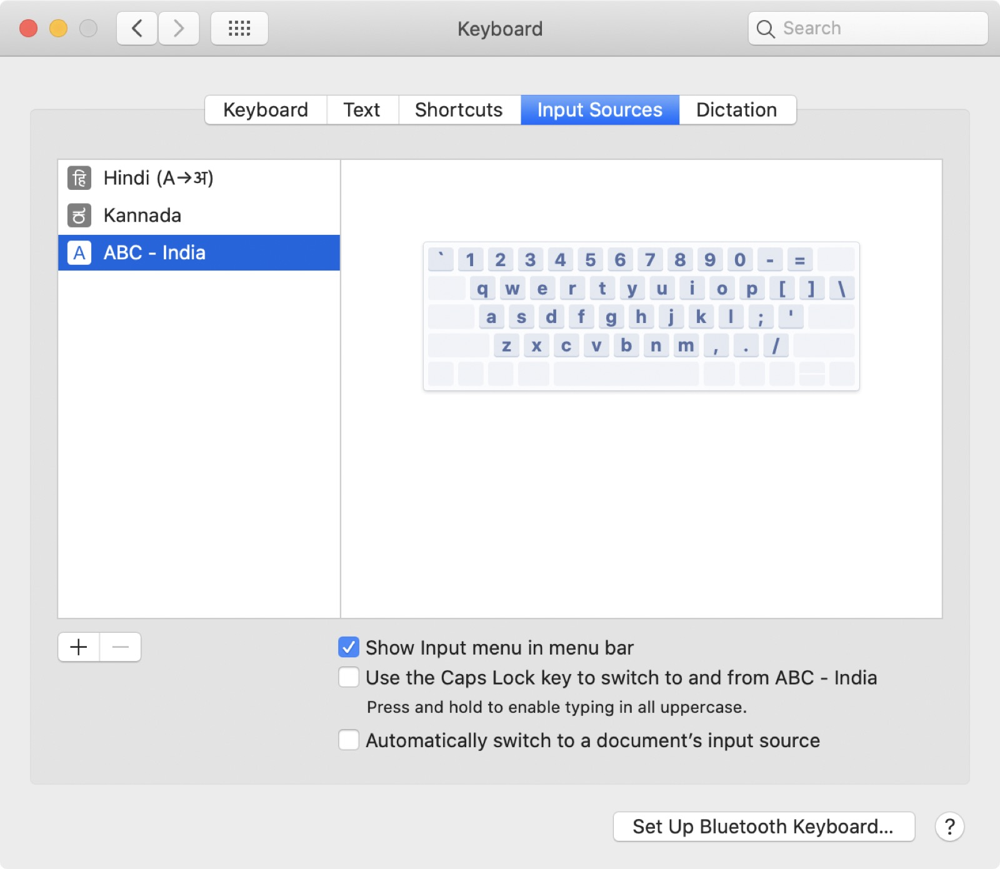

> NOTE: Please ensure that "Show Input menu in menu bar" is checked.

Now, verify that your input sources have been enabled by clicking on the Input menu in the menu bar.

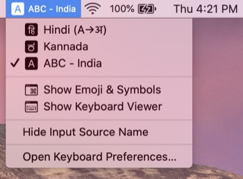

Open Settings in Scrite from the Settings menu and switch to Transliteration tab.

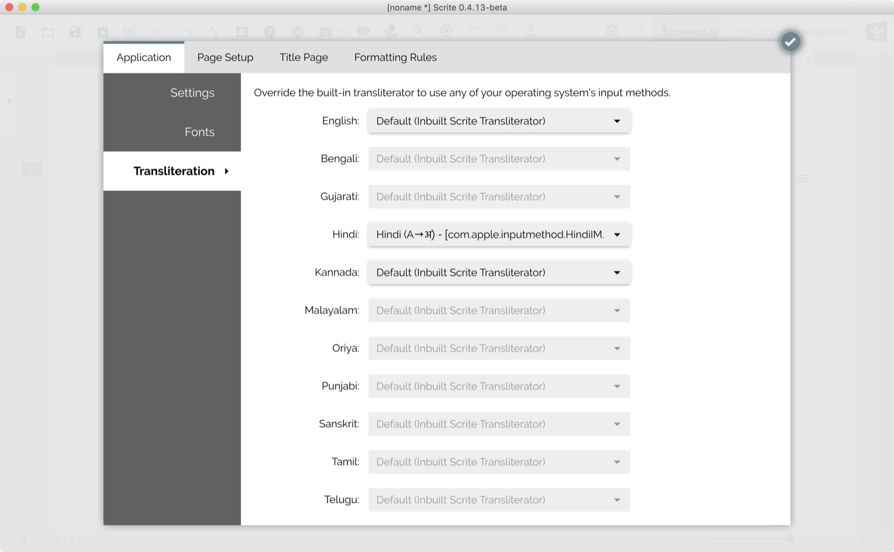

Here, you can assign the macOS's input source with specific languages. Once you have finished mapping the input sources, click on the check mark on the top right of the dialog box.

Now, when you try to write in the mapped languages, Scrite uses macOS's input source as keyboard for transliteration intead of using its own inbuilt one.

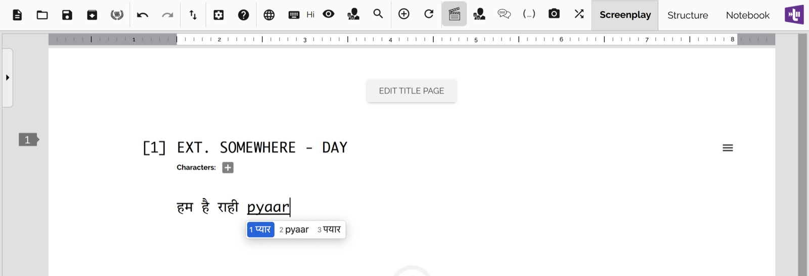

#### Mapping input sources on Windows

On Windows 10, go to Settings > Language and add input methods of your choice.

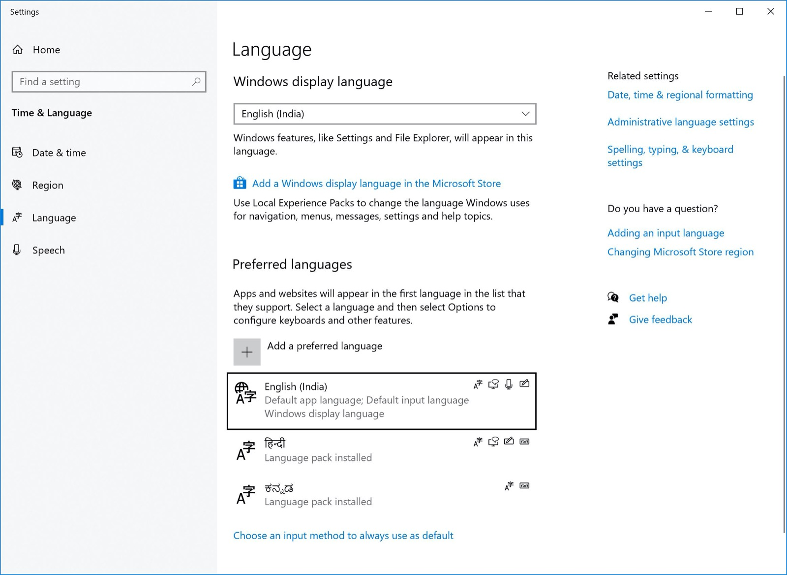

Against, each language ensure that you have chosen Phonetic keyboards. To do that, click on the language in the list.

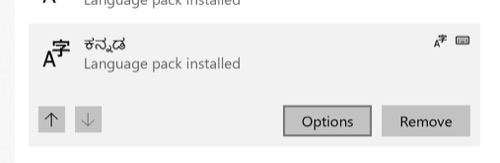

Click on Options and in the resulting window, click on "Add a keyboard" to add a new phonetic keyboard. We recommend that you remove other keyboards if you dont need them.

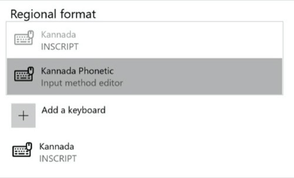

Lastly, ensure that the "Let me set a different input method for each app window" is checked.

Once you have added input methods for all the languaes you like, verify that you are able to switch between them in the status bar.

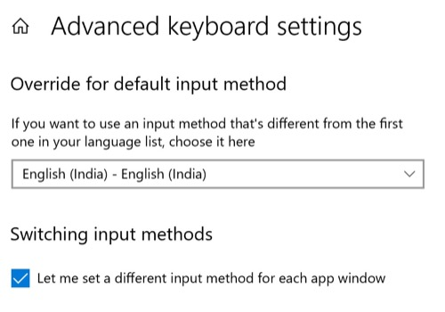

Now, on Scrite you can map languages to the input methods you just enabeld in Settings. Open Scrite's settings dialog box and switch to "Transliteration" page.

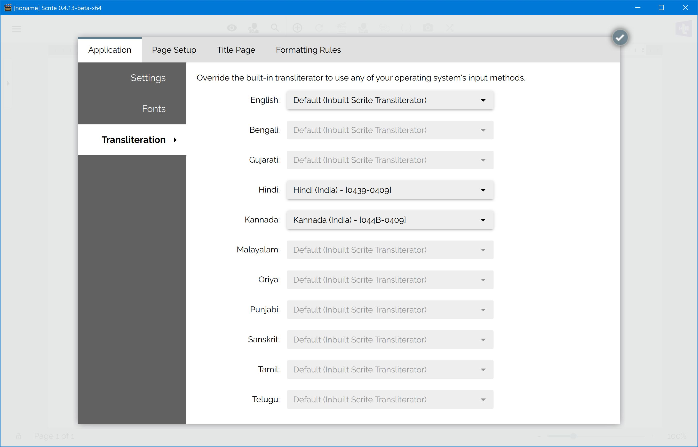

Once you have finished mapping the input sources, click on the check mark on the top right of the dialog box. 

From this point onwards, Scrite will automatically switch to the input method on Windows while typing in mapped languages.

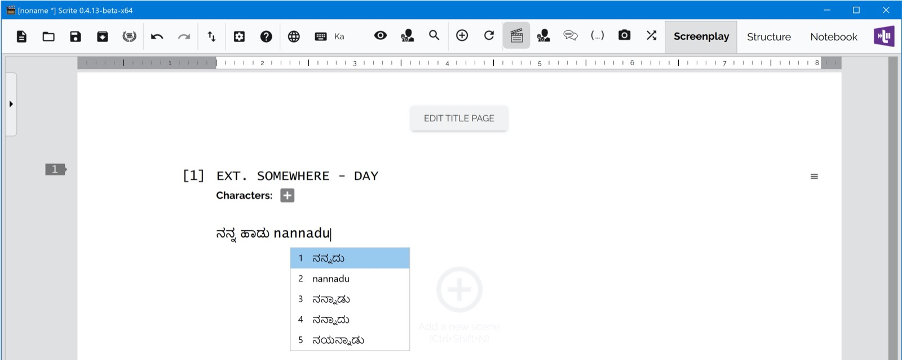

#### Mapping input sources on Linux

As of writing, we do not support input method mapping on Linux. We hope to address this feature gap in a future update.

# Formatting

While Scrite provides comes bundled with default format settings for your screenplay, you can customise many aspects of it. 

## Changing fonts

Scrite bundles default fonts for each language it supports. By default Scrite uses those fonts. However, you can assign different fonts by opening the *Fonts* page in *Application* tab of *Settings* dialog box.

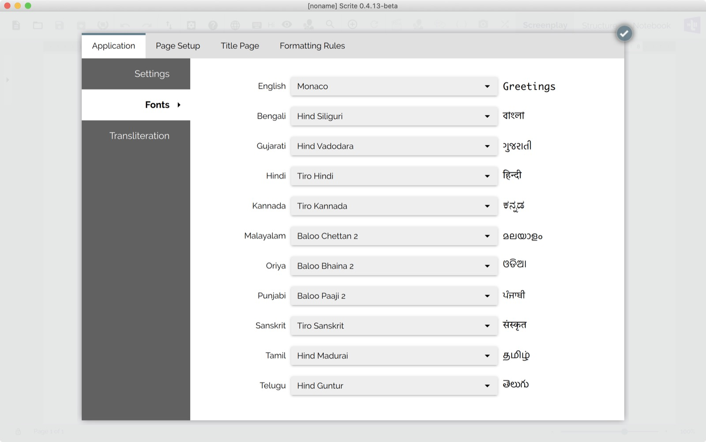

## Altering paragraph styles

Within the *Formatting Rules* tab of the *Settings* dialog box, you can change paragraph styles for each paragraph.

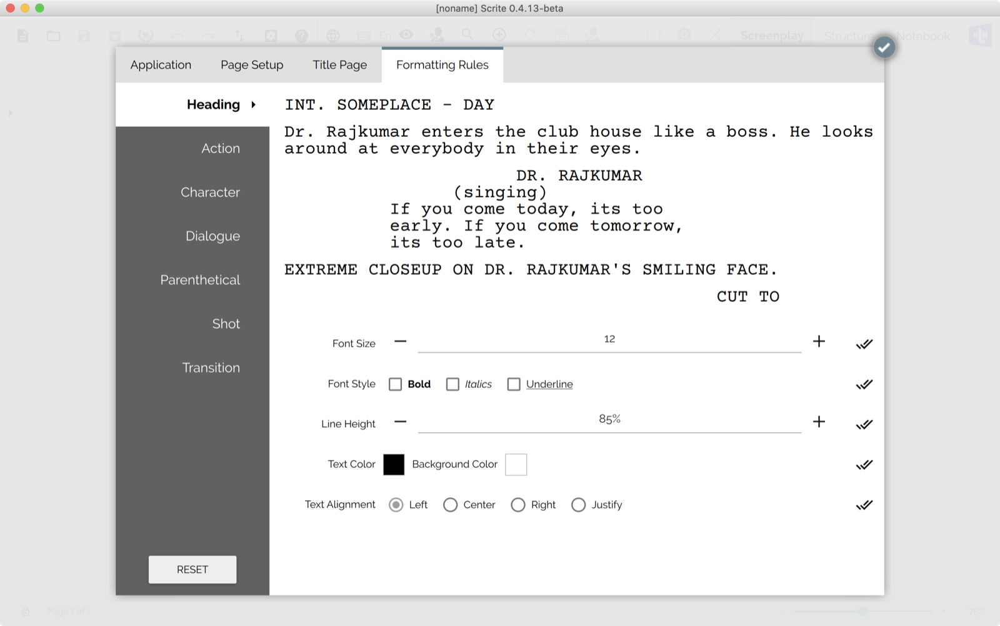

In the screenshot below, you can see how we have changed the color and font-weight of various paragraphs in the screenplay.

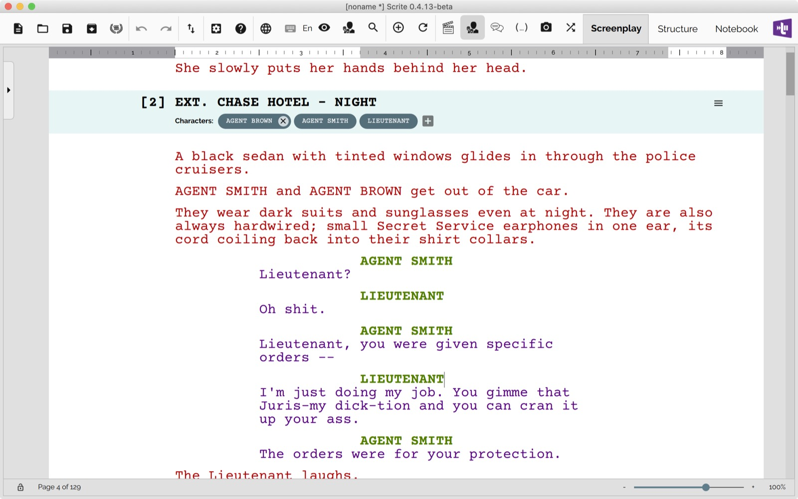

# Configuring a language for dialogues

Suppose that you are writing screenplays in which all dialogues are writting in Kannada, but Action and every other paragraph kind is written in English. You can simply configure the *Language* option to *Kannada*.

From now on, whenever you switch to a dialogue paragraph - Scrite will automatically switch to Kannada language.

# Splitting scenes

# Merging scenes

# Scene List

# Scene Synopsis

# Color Coding Scenes

# Character List

Next: [Exporting Your Screenplay](export.md)