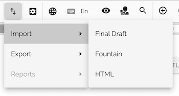
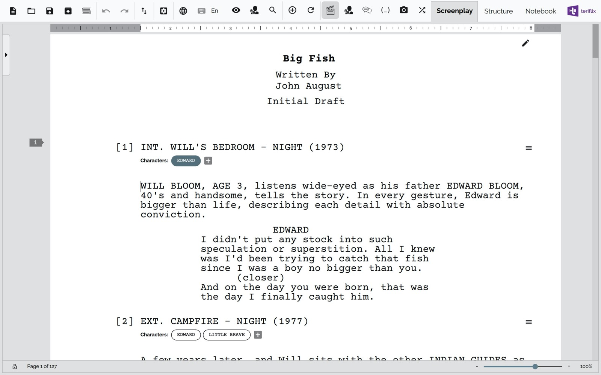
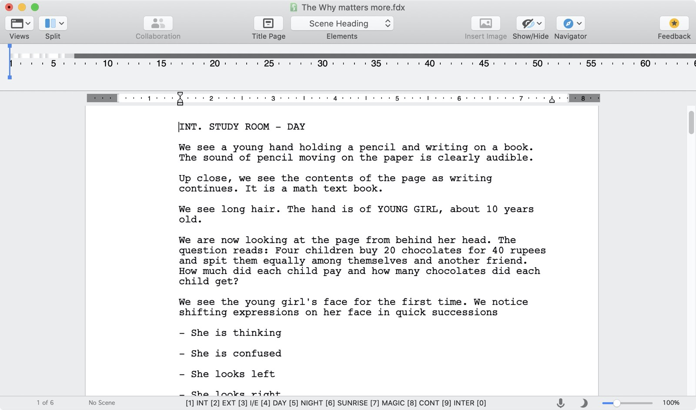
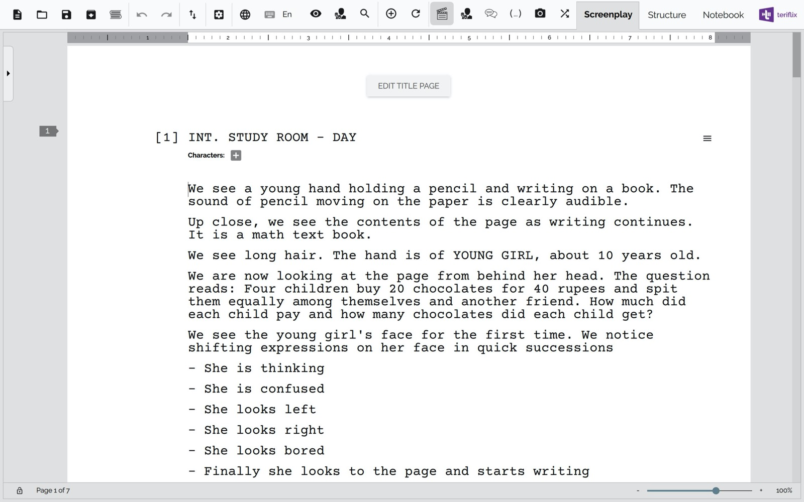

# Importing Existing Screenplays

Scrite allows import of screenplays from Final Draft, Fountain and a specific type of HTML.

To import, just click on the import/export button in the toolbar and choose an import option.

## Importing from Fountain

Fountain is a simple markup syntax for writing, editing and sharing screenplays in plain, human-readable text. Fountain allows you to work on your screenplay anywhere, on any computer or tablet, using any software that edits text files.

Taking its cues from John Gruber’s [Markdown](https://daringfireball.net/projects/markdown/), Fountain files are eminently readable. When special syntax is required, it is straightforward and intuitive.

You can download a sample screenplay in Fountain format from here: [Big-Fish](https://fountain.io/_downloads/Big-Fish.fountain)

Once downloaded, launch Scrite and import the file using Import -> Fountain option. Once imported, you can view, edit and save the screenplay in Scrite format.

## Importing from Final Draft

Final Draft is the leading industry standard screenplay writing software in the world. Several major production companies insist on usage of Final Draft from its writers. 

If you have a screenplay in Final Draft format (because someone sent it to you, or you created one using the trail version of Final Draft); you can import it into Scrite and further edit it here.

In the screenshot below, we can see a screenplay opened in Final Draft.

This screenplay can be imported in to Scrite, by selecting Import -> Final Draft option on the menu and selecting the .fdx file.

## Importing from Celtx

While Scrite does not support importing from native Celtx files, it is possible to export to HTML from Celtx and then import that HTML into Scrite.

Next: [Advanced Editing](advanced-editing.md)