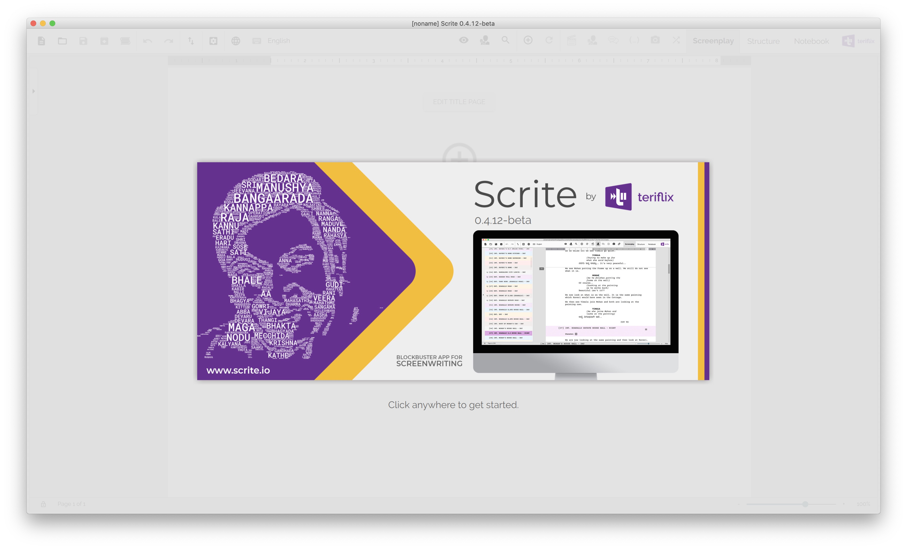

# Welcome to Scrite

Scrite is an open-source, multi-platform screenplay writing app for macOS, Windows & Linux desktop computers. With Scrite you can write in English and 10 other Indian Languages. 

## Table Of Contents

- [Introduction](#introduction)
- [Installing Scrite](installation.md)
- [Quick Start](quick-start.md)
- [Scriptalay - A library of screenplays in Scrite](scriptalay.md)
- [Import Existing Screenplay](import.md)
- [Advanced Editing](advanced-editing.md)
- [Exporting Your Screenplay](export.md)
- [Reports](reports.md)
- [Structure & Timeline](structure.md)
- [Notebook](notebook.md)

## Introduction

Scrite was never conceptualized to be a replacement app for Final Draft, Celtx or any of the existing apps. So, you will find significant differences in our approach to screenplay writing. We believe that this approach will grow on you, if you give it a chance and some time to play around with it.

One of our early adopters sent us this feedback as a rant. We are removing all the rude language from his WhatsApp message, because we like to be civil. But we are retaining the essense of his message.

> Scrite seems like an app written by "software developers" for "software developers" and not writers.

We wonder if screenplay writers can write software unless they are software developers also. So atleast one part of his rant was true. Scrite is an app written by software developers. Its the second part that we are not entirely onboard with. A more accurate way to describe Scrite would be

> Scrite _is_ an app written by "software developers" for "writers" who are willing to look beyond _Final Draft_.

We have absolutely nothing against _Final Draft_, _Celtx_, _Writer Duet_, _Causality_, _Fade In_ and other screenplay writing apps. Infact we love all of them. We would just like an opportunity to present one more way of writing with _Scrite_, in the hope that you may find it useful.

If you are one of those brave writers who dont mind the temporary discomfort that comes along with using any new app; and are willing to invest 20-30 minutes in consideration of another way of writing - then we are so happy to have you here.

Next: [Installing Scrite](installation.md)

