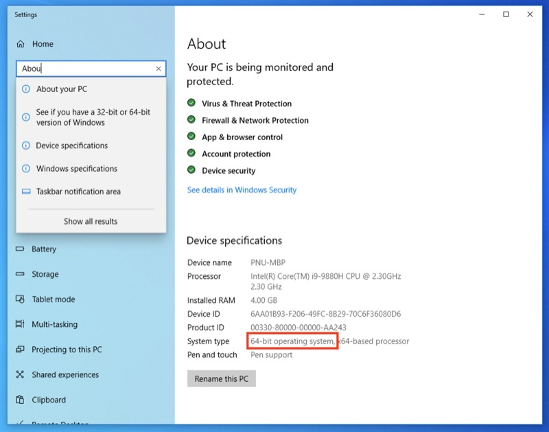
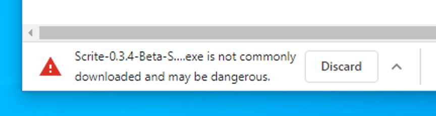
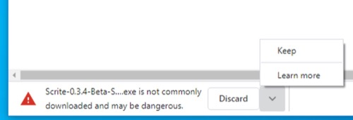
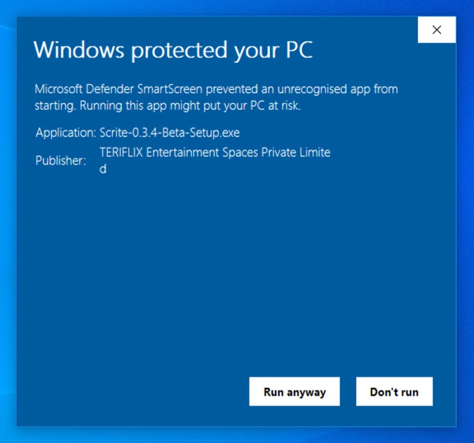
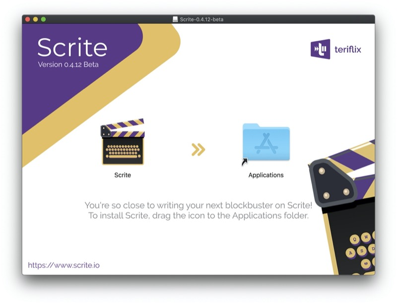

# Installing Scrite

Scrite is a free and open-source product written using [Qt](https://www.qt.io). We provide a installer for Windows, DMG package for macOS and a AppBundle for Linux from [our website](https://www.scrite.io). But you can also build Scrite from code by putting it from this repository if you like.

> PLEASE NOTE: This is a beta release. A software is released for public beta primarily to seek feedback from the public. Our team tests every beta of Scrite before we put it out. But we are human beings and we don't discover all the bugs and crashes in each test cycle, even the seemingly obvious ones that you may run into. If you encounter bugs, crashes, missing features in Scrite, please post about it on our [community forum here](https://www.scrite.io/index.php/forum/). 
> 
> Please read more about what a beta release means here (https://techterms.com/definition/beta_software). If you wish to have a more stable and complete version, we recommend you to wait until we have a 1.0 release. But if you are one of the early adopters who wants to check out Scrite, please feel free to download and please provide feedback.

## Installing on Windows

Depending on the type of Windows PC you use, please download the 32-bit or 64-bit installer from [the download page](https://www.scrite.io/index.php/download-windows) here. 

If you are a Windows 10 user, launch the Settings App. Search for About Your PC in the settings app and look at the System Type field to know which version of Scrite to download.

We provide signed 32-bit and 64-bit installers on [our website](https://www.scrite.io/index.php/download-windows). Our stallers are signed using a OV certificate, therefore Windows may still warn you while downloading and/or installing.

You may choose to click on the ‘keep’ option and confirm your intent to save the file. Or you may want to wait until ur browser no longer shows these warnings.

Once downloaded, double click on the installer file to install Scrite.

When you try to install the downloaded file, you may see a warning from Microsoft SmartScreen Filter. You can click on ore Info” to verify that the downloaded installer is explicitly signed by us. 

Once you verify, you can click on "Run Anyway" button to complete the installation.

### Common Installation Issues

- On Windows 7 or 8.1, please ensure that you have installed all Windows OS Updates before installing Scrite.
- After upgrading Scrite from a previous version to a new one, if you get DLL errors; please manually uninstall Scrite, download a fresh copy of the installer from our website and try installing again.
- Scrite is known to crash more on Windows systems running old Intel Graphics Drivers. Kindly ensure that you have updated your graphics drivers to the latest versions before using Scrite.

## Installing on macOS

We provide signed DMG package for macOS on [our website](https://www.scrite.io/index.php/download-macOS). When you download and mount the DMG you will see a screen like this

> NOTE: While updating, please make sure that you have closed any open instances of Scrite on your Mac.

Simply drag and drop the Scrite icon to the Applications folder. Once macOS finishes copying Scrite to your Applications folder, launch it from Spotlight and start using the app.

## Installing on Linux

We provide an unsigned AppImage bundle for 64-bit Linux distributions that support it. Please download the app bundle from [our website here](https://www.scrite.io/index.php/download-linux).

Once you download, you can unpack and install it using the following commands

    $ tar -zxvf Scrite-x.y.z-beta.AppImage.tar.gz
    $ cd ~/Scrite-x.y.z-beta.AppImage
    $ sh install_Scrite.sh

> NOTE: If you are running Ubuntu LTS; right click on the scrite.desktop file in your desktop and check the “Allow Launching” option.

Now you can double click on the Scrite app in your desktop or launch Scrite from the start menu of your Linux distribution.

## Building from Source

If you are a developer and wouldn't mid building Scrite from its source code, then this section is for you.

### Setup Qt 5.13.2

Scrite is developed using [Qt](https://www.qt.io). Right now we are building Scrite using Qt 5.13.2, which you can [download from here](http://download.qt.io/official_releases/qt/5.13/5.13.2/).

### Pull the source code and build

    mkdir ~/ScriteProject
    cd ~/ScriteProject
    git clone https://github.com/teriflix/scrite.git 

Once the source code of Scrite has been pulled into your local computer, you can open scrite.pro from $HOME/ScriteProject/scrite folder in Qt Creator. Simply build and run the project.

If you like to build from the command line, then you can:

    cd ~/ScriteProject/scrite
    /path/to/qmake 
    make
    ../Releases/scrite

Although Scrite depends on 3rd party (GPL friendly) libraries, we have bundled them all into our git repsitory so that you dont have to setup dependencies in order to build Scrite.

## Next Steps

Okay, now that you have built Scrite - you must be wondering how to use it. Head over to our [Quick Start](quick-start.md) guide right away.

