# Quick Start

So, you are a writer. You have a story in mind that you want to write as a screenplay. You launch Scrite and this is the first screen you are shown.

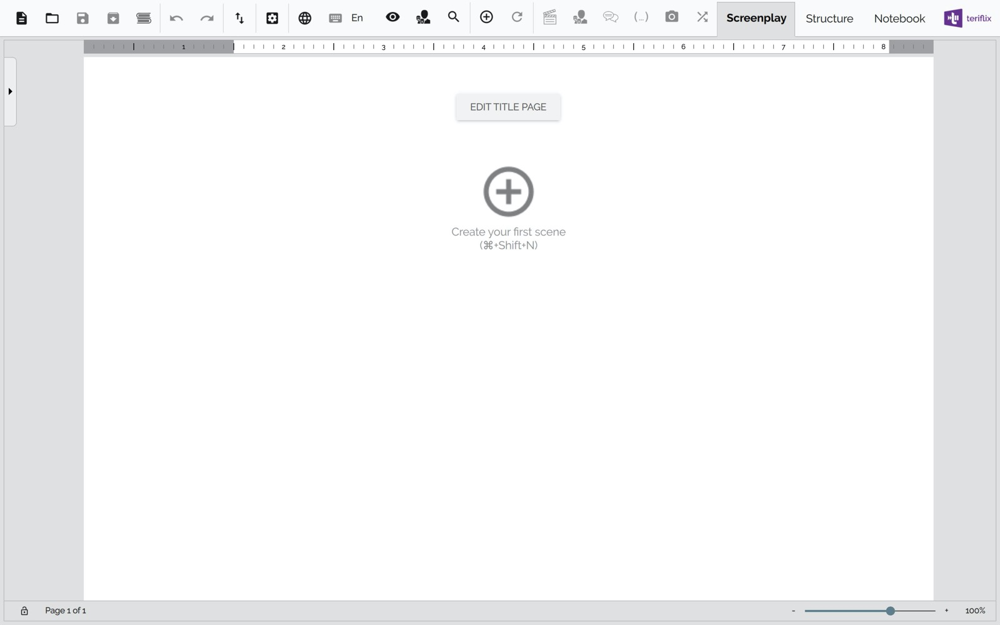

## Create Your First Scene

To create your first scene, you can just click on the + icon in the page area.

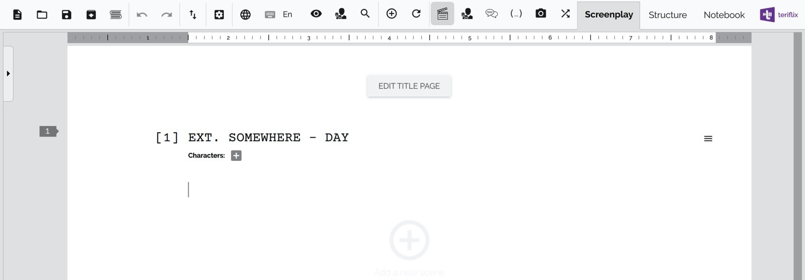

You will notice that the scene has a default scene heading that reads 

    EXT. SOMEWHERE - DAY

You can ofcourse change the scene heading by clicking on it.

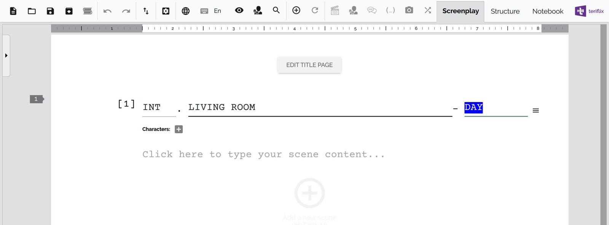

Once you are done, you can hit the Enter key or click on the scene content area to start typing your scene content.

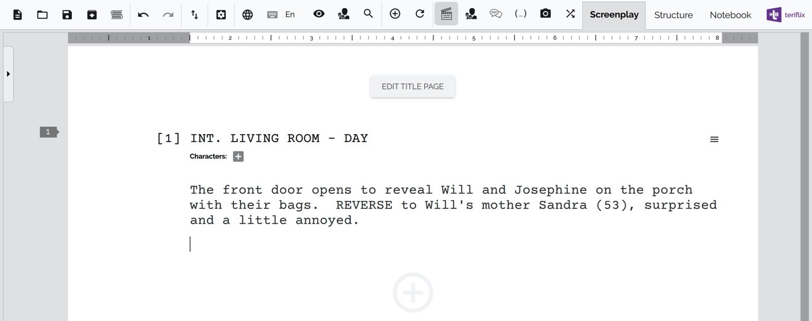

The text you notice in the screenshot above is formatted as [Action](https://www.masterclass.com/articles/what-is-a-screenplay-formatting-tips-and-tricks#how-to-format-a-screenplay-step-2-action).

Lets say you want to now include a dialog between Sandra and Will. Just start a new paragraph by hitting the Enter (or Return) key on your keyboard. 

Notice the toolbar on the top?

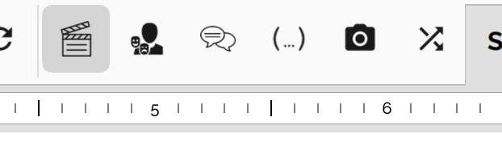

From left to right, it has the following toggle buttons for changing the formatting type of your current paragraph

-  Action
-  Character
-  Dialogue
-  Parenthetical
-  Shot
-  Transition

You can click on any of these buttons to switch the formatting style of the current paragraph.

Coming back, lets look at how to type dialogues.

- Click on the Character icon to switch paragraph style to Character, and type your character name. 
- Notice that it will automatically appear in CAPS. 
- Hit Enter to create a new paragraph. 
- Notice that Scrite switches to Dialogue format automatically. Now you can type a dialogue in there.
- Hit Enter to create a new paragraph.
- Notice that Scrite switches to Character format automatically. Now you can type another character name.
- Hit Enter to create a new paragraph. 
- Notice that Scrite switches to Dialogue format automatically. Now you can type a dialogue in there.

And you can go on like this. At any point, you can switch back to Action by clicking on the Action button.

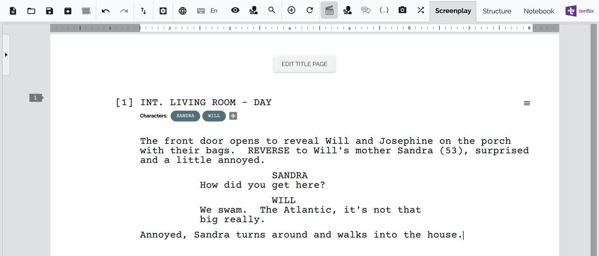

## Keyboard Shortcuts

Click on the Settings button in the toolbar and then the Shortcuts menu item to launch the Shortcuts window. 

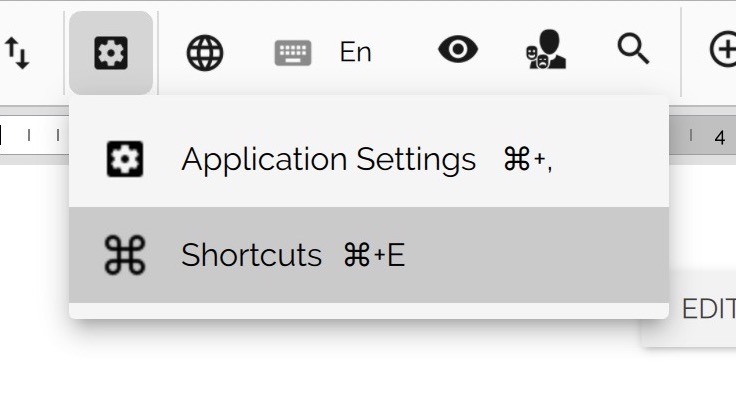

This window shows all the shortcuts you can use in Scrite.

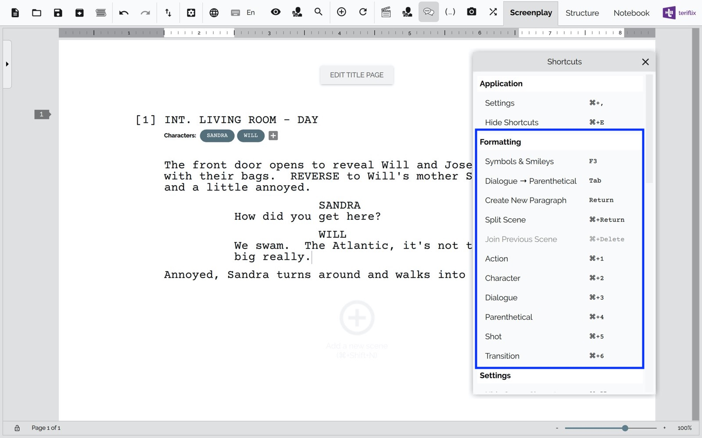

In the formatting section, you can find all the shortcuts that make your editing experience far more productive. For example ⌘+2 on macOS will change the formatting style of the current paragraph to Character.

## Creating A New Scene

Once you finish writing your first scene, create a new scene by clicking on the + icon at the bottom. Once you over the mouse over that icon, it becomes a bit more prominent.

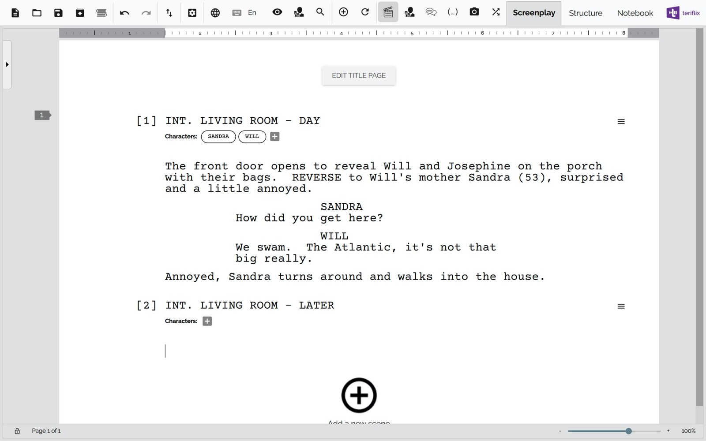

You will notice that the cursor will already be placed in the new scene. Now you can type the contents of your next scene here.

This way you can go on writing scenes, one after the other.

## Editing the Title Page

Click on the "Edit Title Page" button at the top of the screen play edit area.

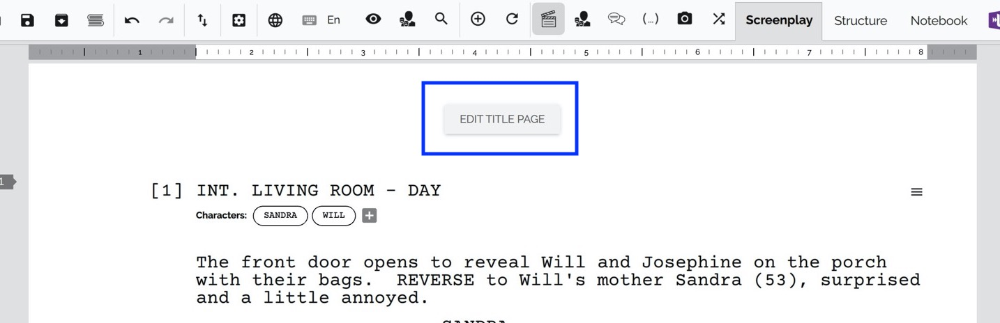

Scrite will popup a dialog box in which you can edit your title page fields.

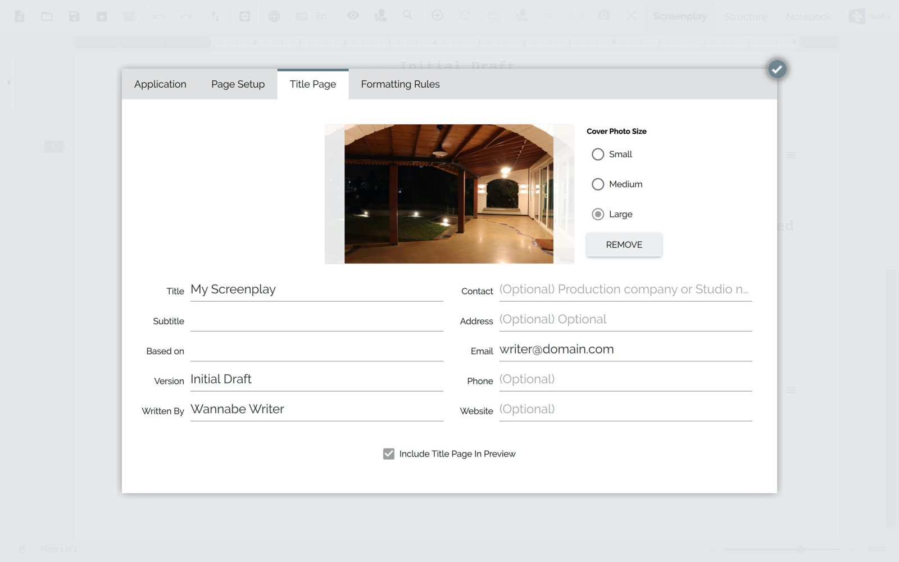

Close the dialog box by clicking on the button on the top right corner of the dialog box. Scrite will now present the title page as designed by you in the dialog box. 

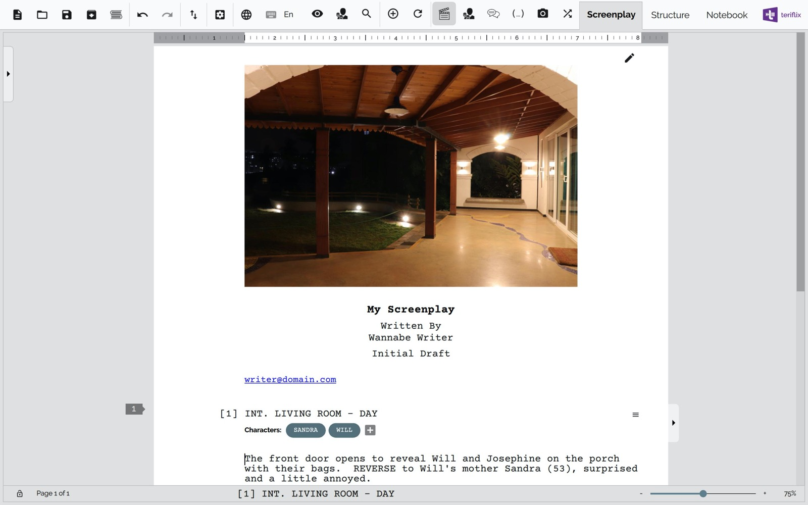

## Preview the Screenplay

Just click on the Preview icon in the title bar to view a print-preview of your screenplay, complete with header, footer and watermark.

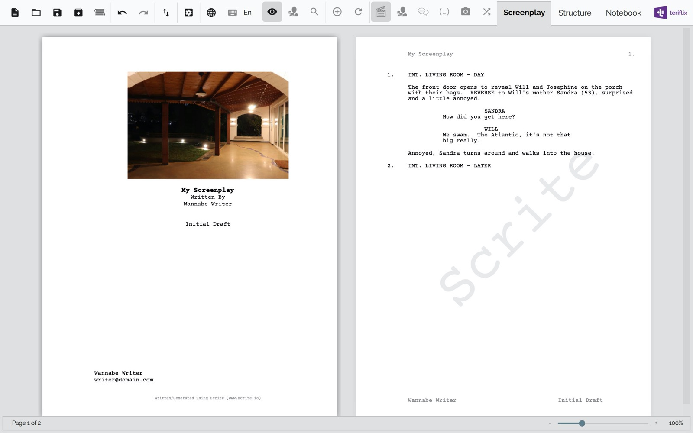

## Configure Header, Footer and Watermark

Launch the Settings dialog box by clicking on the Settings icon and then on Application Settings.

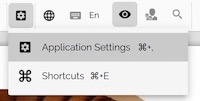

Switch to the Page Setup tab in the resulting dialog box to edit header, footer and watermark settings.

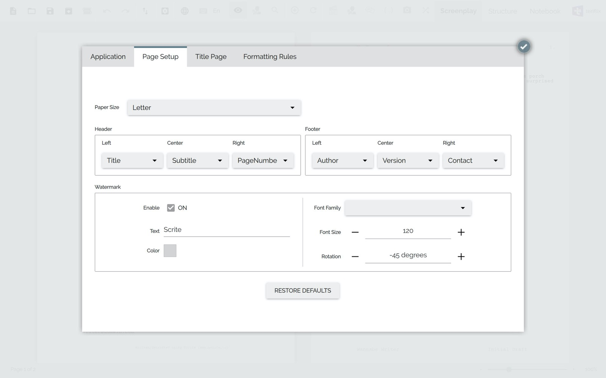

## Export to PDF

Once you are done writing, you can export to PDF for sharing with other people. Click on the export button on the toolbar and select Export -> Adobe PDF option.

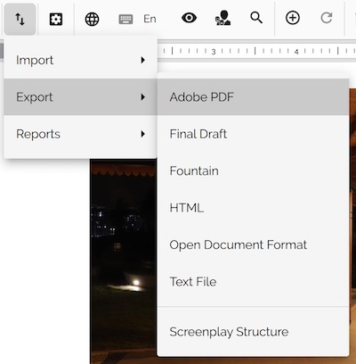

In the resulting dialog box, you can configure the exporter.

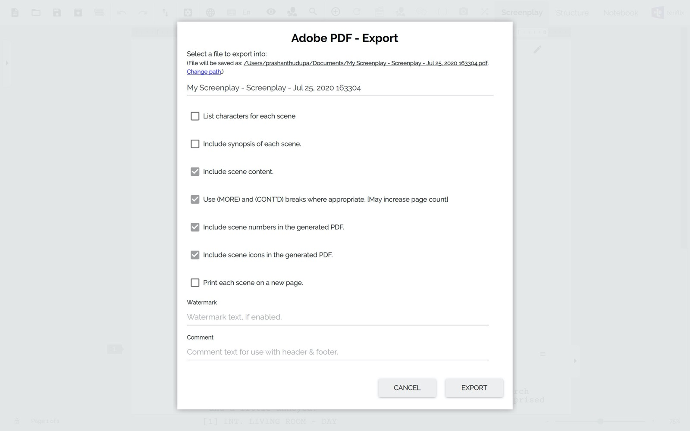

Finally, you can click on the "Export" button to export your screenplay in PDF format. 

> On macOS and Windows, Scrite will launch Finder and Explorer and point to the exported PDF file. You can simply double click and open the file.
>
> 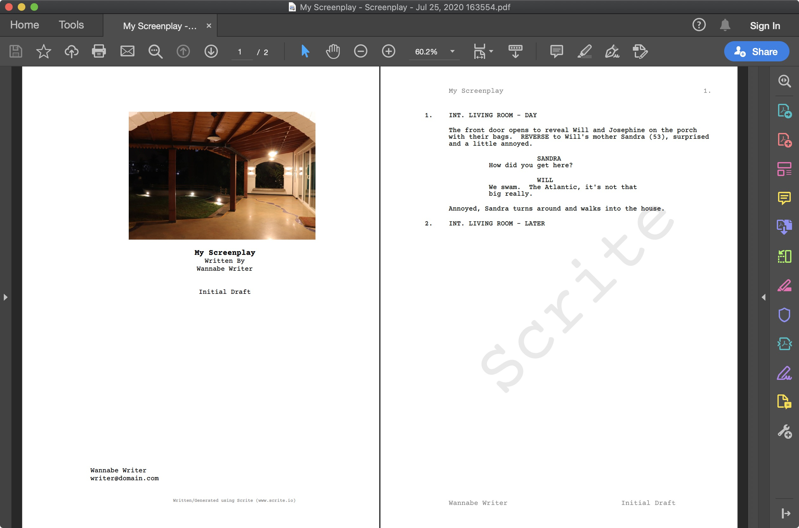

That's it! That was our quick start guide for you. You should be ready to get started with just this much information.

What's next?
- For one, you can start writing your next screenplay with what you have learned so far.
- OR, you may want to [import your existing screenplay](import.md) and continue working on it in Scrite.
- OR, you may want to read one or more screenplays from our [Scriptalay](scriptalay.md).
- OR, you may want to know some of the [advanced editing features](advanced-editing.md) available in Scrite
- OR, maybe you want to dive into features like [structure, timeline](structure.md) and [notebook](notebook.md).
- OR, maybe you want to know about all the various [export](export.md) options we have.
- OR, maybe you want to know about [generating reports](reports.md).
