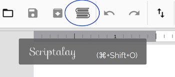
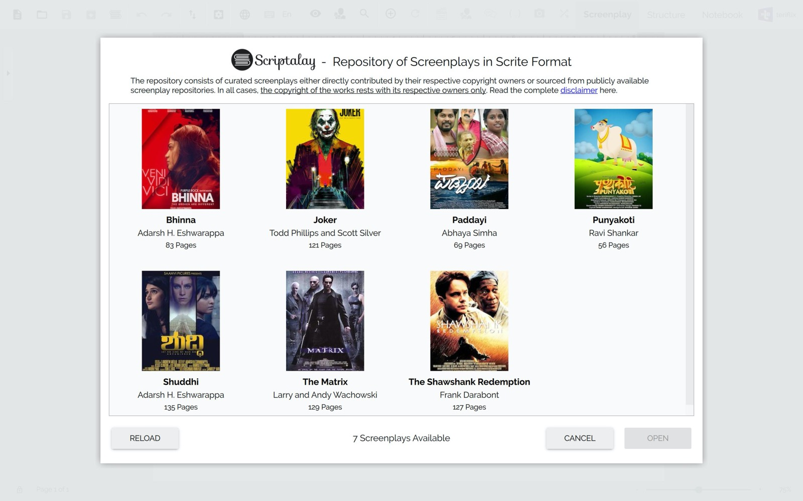
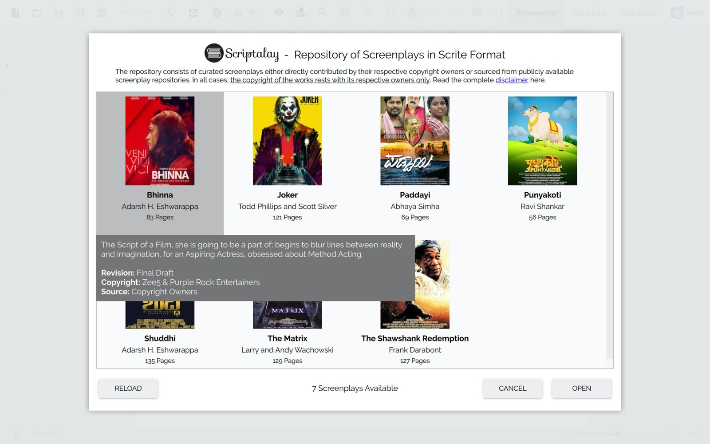
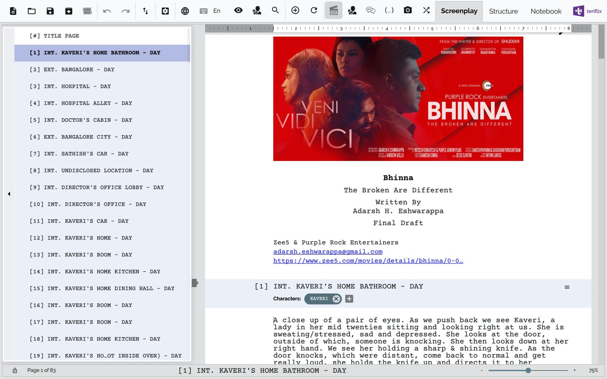
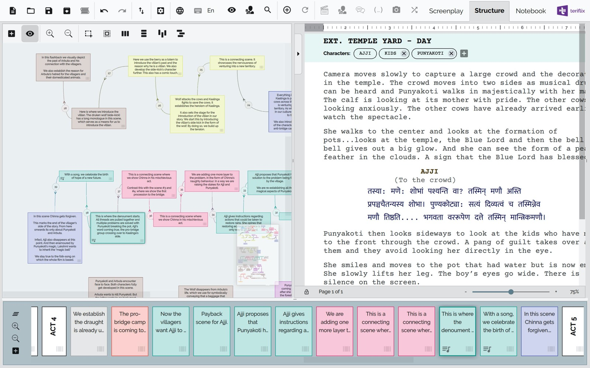
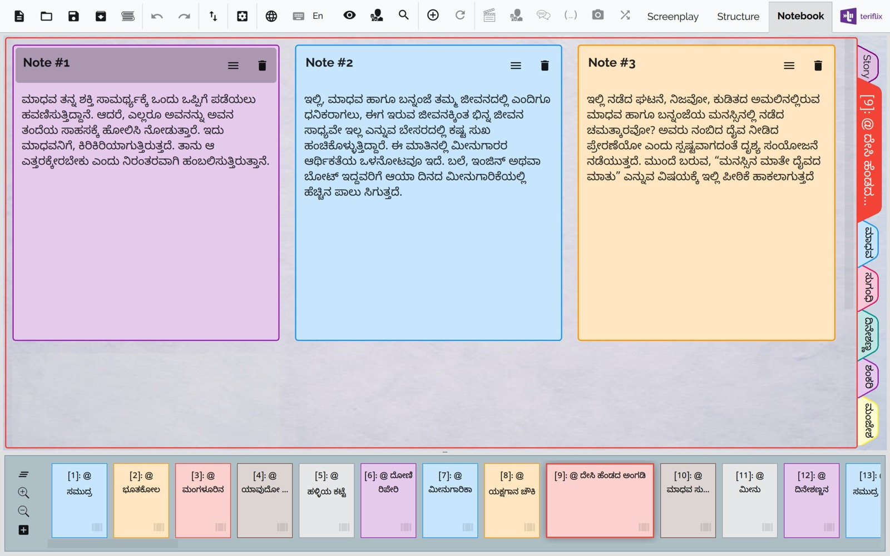

# Scriptalay

Scriptalay is a play on the words Script & Granthalay (which means Library). It is a library of screenplays in Scrite format hosted online by us, that you can download and read on your Scrite app. It is a small list right now, but we intend to add more to it in the coming weeks.

To launch Scriptalay, simply click on the Scriptalay button in the toolbar.

Scrite will show you a dialog box with all screenplays current available in the library.

You can click on any of the screenplays to view more details in a tooltip.

You can either double click on any of the screenplays OR select it and click on "Open" button to download and read it in Scrite.

Some of the screenplays have a visual capture of [structure](structure.md), which you can examine by switching to the "Structure" tab. For example, the screenplay of [Punyakoti](https://www.scrite.io/index.php/punyakoti-screenplay/) has its structure captured as follows.

There are sceenplays, where the author has captured notes against scenes and even one or more characters. You can view them in the [Notebook](notebook.md) tab. 

The purpose of hosting screenplays in the library is to 
- Provide a curated list of screenplays to study from
- Get a sense of how a real screenplay would look in Scrite
- Try out all [export](export.md) and [reports](reports.md) options.

 But if you have a screenplay already written in Final Draft, or Microsoft Word, or Celtx or even in Fountain format; read the chapter on [Importing Screenplays](import.md) to know how to import your existing work into Scrite.
 