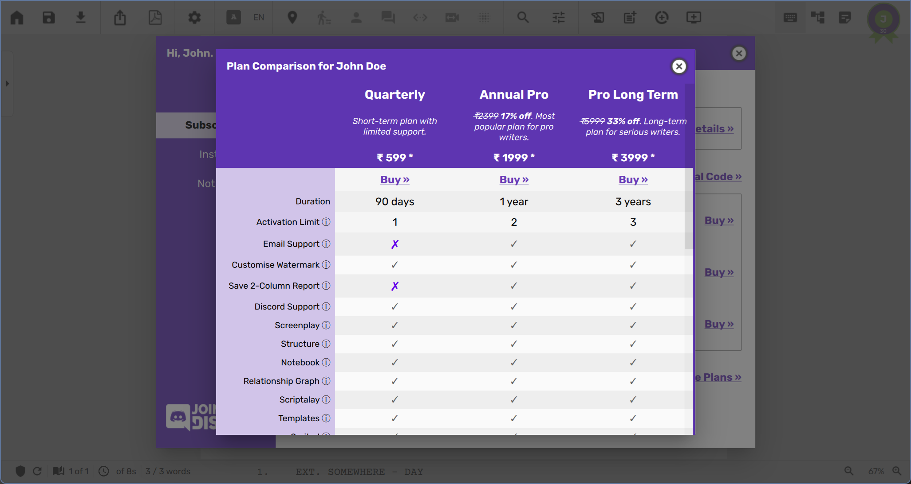
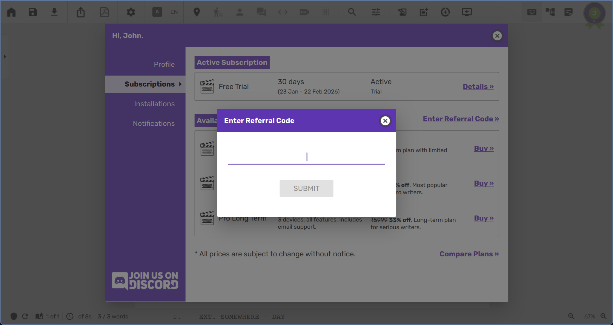

# Welcome to Scrite
Scrite is an open‑source desktop screenwriting app for Windows, macOS, and
Linux. You can write in multiple languages, export industry‑standard PDFs, and
generate reports and more. Watch this video to get a quick visual overview of
the product.

  <iframe src="https://www.youtube.com/embed/T7J_8ebSVsk" style="position: absolute; top: 0; left: 0; width: 100%; height: 100%;" frameborder="0" allowfullscreen></iframe>

## Quick Links

- [Official Scrite Website](https://www.scrite.io/)
- [Downloads Page](https://www.scrite.io/downloads/)
- [Pricing](https://www.scrite.io/pricing-and-features/)

## Scene‑Centric Approach
Most screenwriting apps treat a screenplay like a series of pages, but Scrite
treats it like a series of scenes—because that’s how movies are made. Instead of
focusing on page counts, Scrite helps you structure and visualize your story
through its structure-first-scene-centric UI.

## Why Scenes First?
Screenwriting apps have traditionally mirrored typewriters, where each page
roughly translates to one minute of screen time, a format deeply rooted in the
industry. While page count remains important, Scrite shifts the focus to scenes
because that’s how filmmakers think.

In Scrite, you don’t write with pages in mind—you build your screenplay scene by
scene. This approach makes it easier to structure your narrative, see
relationships between different scenes, and navigate your story organically.
Scrite incorporates familiar elements from traditional apps, but presents them
in a way that prioritizes scene flow rather than rigid page formatting.

By embracing this scene-first mindset, Scrite offers a unique writing experience
that better aligns with the way stories are conceived, developed, and brought to
life.

Scrite still supports industry standards but helps writers think in scenes first.

| Page‑Centric Apps	| Scrite’s Scene‑Centric Approach| 
|:------------------|:-------------------------------|
| Think in pages | Think in scenes | 
| Screenplay length = page count | Screenplay length = scene flow | 
| Mimics typewriters | Mimics filmmaking structure | 
| Formatting = aligned with industry standard | Formatting = aligned with industry standard | 
| Navigation = scroll through pages | Navigation = jump between scenes | 

## What Scrite Is Not
To set expectations clearly, here’s what Scrite does not aim to be.

### Page‑Centric ✗
Scrite is not a direct replacement for traditional screenwriting apps like Final
Draft, Celtx, or Arc Studio. It doesn’t mimic the typewriter-based, page-centric
approach these apps follow. Instead, it reimagines screenplay writing by
focusing on scenes as the fundamental unit of storytelling.

> **NOTE**: Scrite does calculate page count, estimates screentime, and displays
> approxmate page boundaries. However, it is not designed to be a page-centric
> editor.

### Cloud Storage ✗
Scrite saves files locally on your computer. We don’t store your work on our
server, and therefore cannot offer file sync across different devices, nor can
we offer to recover your lost files. 

While Scrite does offer to [auto save](./files.md#auto-save) changes frequently,
helps restore from a [backup](./files.md#loading-a-backup) and also [store
unsaved](./files.md#vault) ones in a private vault, these still rely on your
local computer storage. 

> In the future, we plan to add built-in integrations for popular cloud storage
> services like Google Drive and OneDrive. Until then, you can use the
> folder-sync features provided by these platforms for file sync and backup.

### Real‑Time Collaboration ✗
Scrite doesn’t support multiple writers editing the same document
simultaneously. The app [warns](./files.md#lock-file) when a file is opened on
more than one device, but safeguards aren’t foolproof. Concurrent editing may
cause conflicts or data loss. We recommend using [Shield](./files.md#shield)
to limit write access to one or more users identified by their email.

> Real-time collaboration is planned for a future update.

### Dark Mode ✗
Dark mode is one of our most‑requested features. We appreciate how helpful it is
and plan to add it. For now, Scrite doesn’t include a dark theme, and we
apologise if this is a deal breaker for you.

### AI Copilot ✗
Scrite doesn’t include built‑in AI features today. If you prefer an AI copilot,
you can use tools like ChatGPT, Claude, Grok, or Gemini alongside Scrite.

We’re exploring AI‑enabled workflows that respect your creative voice. When
they’re ready, we’ll announce them on our website and in this guide. 

### Production Planning ✗
Right now, Scrite focuses on offering a smooth writing experience. In the near
future we plan to build product planning tools like,

- Shot division
- Storyboarding
- Scheduling
- Call sheets
- Budgeting
- Customizable reports
- Production tracking
- Companion apps for mobile and tablets

We also intend to offer AI assists that support these workflows—without getting
in the way of your creative process. 

## Supported Platforms
Scrite is a desktop app for Windows, macOS, and Linux.

> As of writing Scrite is not available for tablets and mobile phones, though we
would like to support them at some point in the future.

### Minimum Requirements
- Operating System 
    - Windows 10 or later 
        - Scrite may run on Windows 7/8.1, but it’s not actively tested. 
        - If installation fails or the app won’t start (DLL errors), install
          Windows Updates and then reinstall Scrite.
    - macOS High Sierra 10.13 or later
        - Universal builds with native support for both x86_64 and Apple Silicon 
    - GNU/Linux
        - Ubuntu 22.04 or later
        - X11 or Wayland
- Hardware
    - Display Resolution: 1366x768 or higher recommended
    - RAM: 8 GB
    - Any Intel processor with 2 cores or more
    - Graphics Card with 16MB or more VRAM is recommended, although not
      absolutely required

The best way to check if Scrite works for you is to install it and use the free
trial for a couple of weeks.

## Installing Scrite
Download the installer for your OS from the
[Downloads](https://www.scrite.io/downloads) page.

> **Note:** Review installation instructions on the Downloads page for Windows,
> macOS, and Linux.

## Subscription Options
On first launch, create a Scrite account and activate the 30‑day free trial—or
sign up for a paid plan.

> **Note:** Without an active subscription (trial or paid), the app is locked.

### Scrite Account
On first launch, set up your login using your email address.

> **Note:** Your Scrite account manages trials and subscriptions. It doesn’t
> sync documents or settings across devices.

Click "Continue" and you’ll receive an activation code by email.

Copy the code and paste it into Scrite.

Once verified, Scrite issues license tokens and unlocks the app.

License tokens renew automatically as long as you’re online and use Scrite at
least once every 28 days. If the app can’t connect within that window, it locks
and prompts you to reactivate.

### 30‑Day Free Trial
Try all features and ensure Scrite works on your devices. Click "Start" next to
Free Trial—no credit card required. You can import from other formats and export
Scrite documents to third‑party formats.

The following features are restricted during the free trial:

- PDF watermarks can’t be configured or removed. 
- Two‑Column Report can’t be saved to PDF. 
- No email support.
- Use of the app is limited to one device at a time (details later).

At any time during your trial, you can purchase a plan. Paid features unlock
immediately for the rest of your trial and for the duration of your plan.

Plans, prices, and currency vary by location. Film‑school students can email
support@scrite.io for discounted options.

### Purchase a Plan
After starting your trial, you can explore available plans or close the profile
window and start writing.

At any time, click the [`User Account`](./user-account.md) icon (top‑right) to
open the User Profile dialog. Switch to the Subscriptions tab to view available
plans.

Click `Compare Plans` (bottom‑right) to open a feature comparison table.

Review features carefully before purchasing. Cancellation or upgrade isn’t
currently offered.

When ready, click `Buy` on your chosen plan. Complete payment in the browser,
then return to Scrite—the plan activates immediately. If trial days remain, the
app may still show "TRIAL", but paid features are available.

If you run into payment or activation issues, check the FAQ. For help, email
support@scrite.io.

> NOTE: [Latest plans and pricing](https://www.scrite.io/pricing-and-features/)
> can be looked up on our website.

### Referral Code

Sometimes you may get hold of a referral code from one of our partners, or
existing subscribers. You may enter the referral code by clicking on the `Enter
Referral Code` link. This will open a dialog box into which you can enter the
referral code to unlock special discounted plans, provided the codes are valid
and active.

