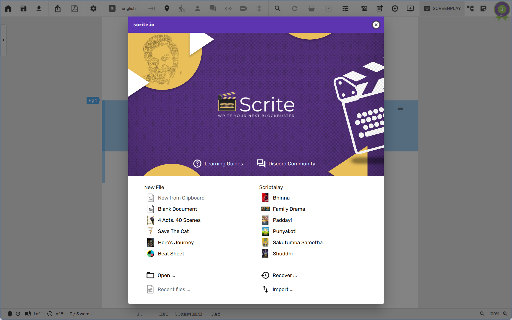
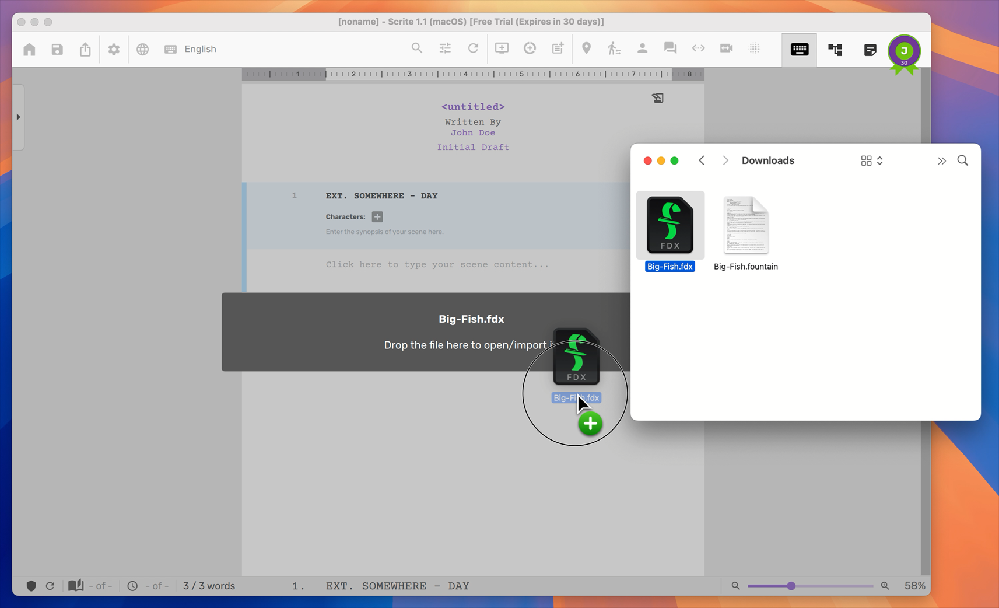
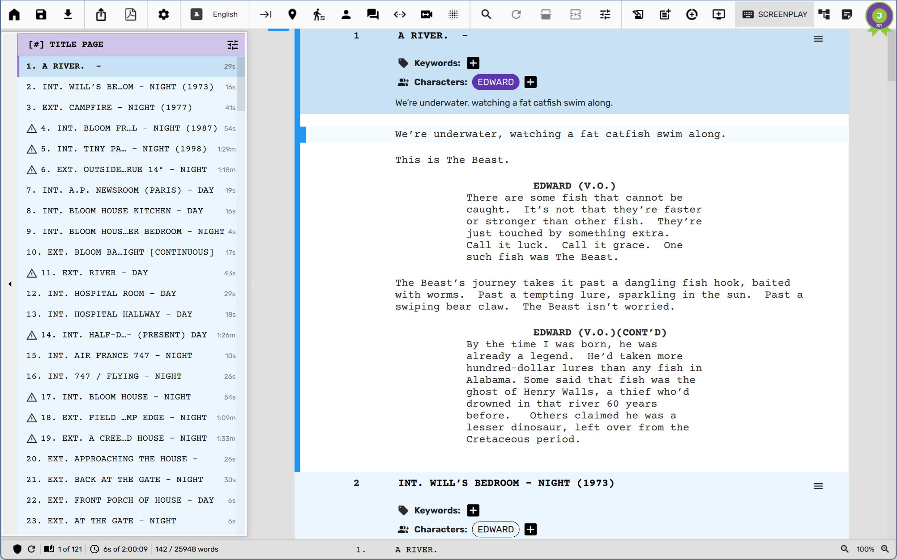
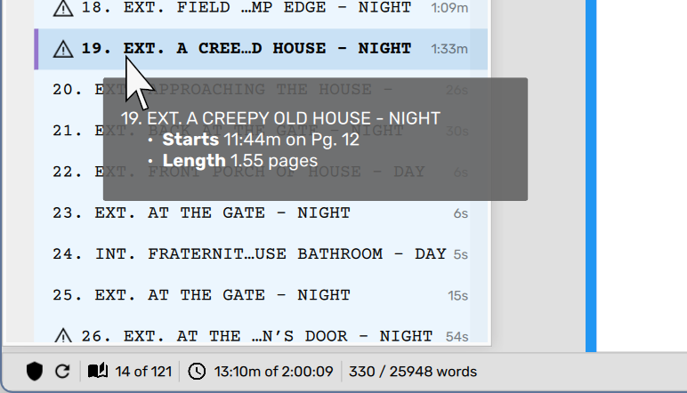
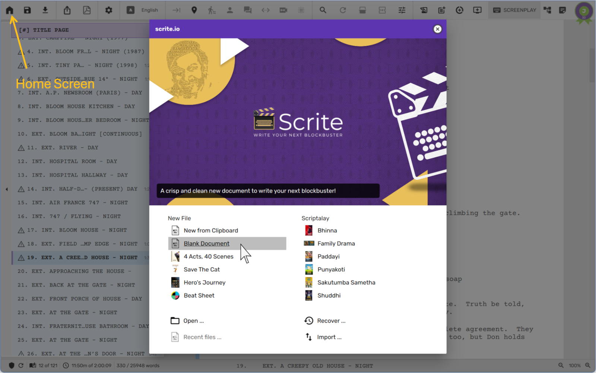
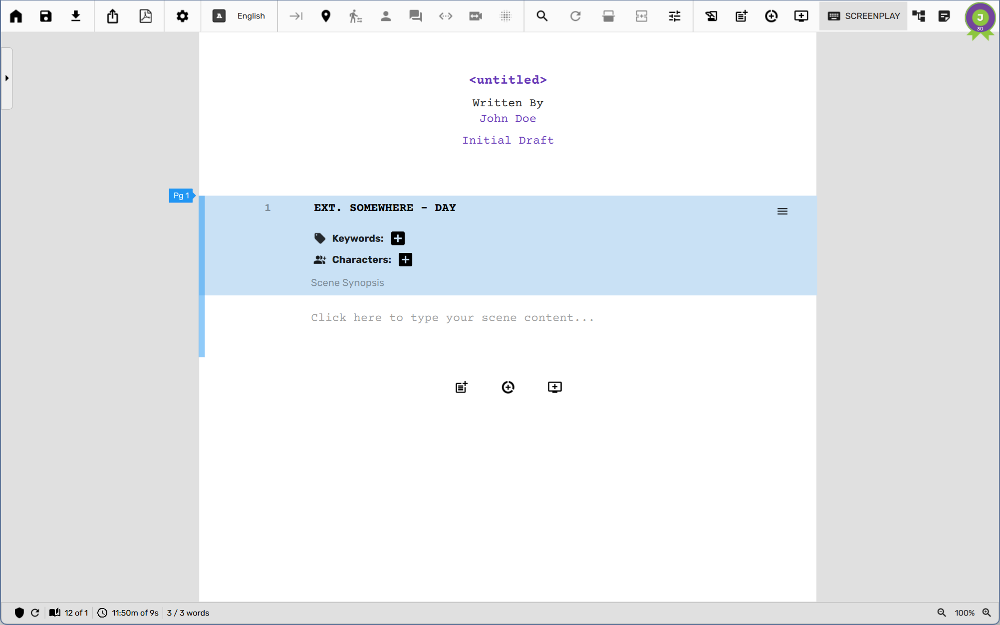
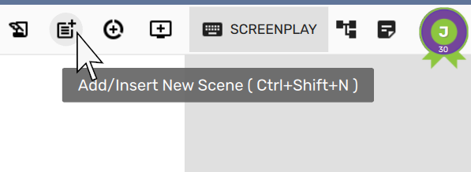
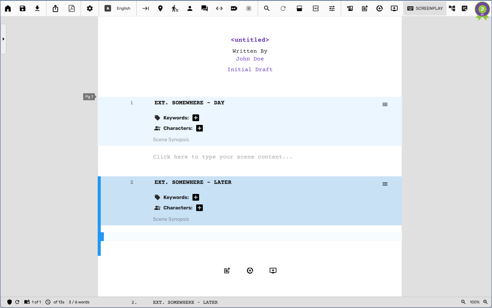
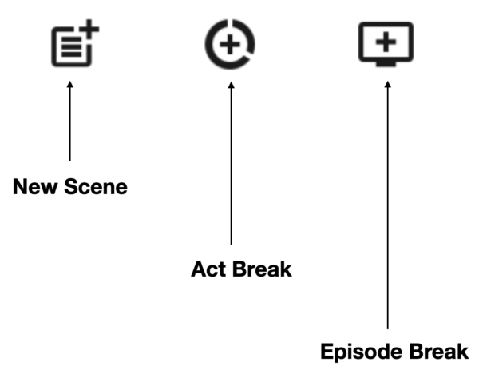

# Quick Start
Scrite is an open-source desktop screenwriting app. It's available for  Windows, macOS and Linux
laptops and desktops. You can write in multiple languages easily, and create professional industry
standard PDF exports, and reports. Whether you are a beginner, or have just learned screenwriting,
or a professional; Scrite has you covered. 

## Scene Centric Approach
Most screenwriting apps treat a screenplay like a series of pages, but Scrite treats it like a
series of scenes—because that’s how movies are made. Instead of focusing on page counts, Scrite
helps you structure and visualize your story through its scene-centric UI.

## Why is Scrite Scene Centric?
Screenwriting apps have traditionally mirrored typewriters, where each page roughly translates to
one minute of screen time—a format deeply rooted in the industry. While page count remains
important, Scrite shifts the focus to scenes because that’s how filmmakers think.

In Scrite, you don’t write with pages in mind—you build your screenplay scene by scene. This
approach makes it easier to structure your narrative, see relationships between different scenes,
and navigate your story organically. Scrite incorporates familiar elements from traditional apps,
but presents them in a way that prioritizes scene flow rather than rigid page formatting.

By embracing this scene-first mindset, Scrite offers a unique writing experience that better aligns
with the way stories are conceived, developed, and brought to life.

Scrite still supports industry standards but helps writers think in scenes first.

| Page-Centric Apps	| Scrite’s Scene-Centric Approach| 
|:------------------|:-------------------------------|
| Think in pages | Think in scenes | 
| Screenplay length = page count | Screenplay length = scene flow | 
| Mimics typewriters | Mimics filmmaking structure | 
| Formatting = aligned with industry standard | Formatting = aligned with industry standard | 
| Navigation = scroll through pages | Navigation = jump between scenes | 

## What Scrite is not?
Now, that we have made a case for scene-centric UI in Scrite, its important for us to clarify what
Scrite is not, so that you know what to expect and what not to in the app.

### Not Page Centric
Scrite is not a direct replacement for traditional screenwriting apps like Final Draft, Celtx, or
Arc Studio. It doesn’t mimic the typewriter-inspired, page-centric approach these apps follow.
Instead, it reimagines screenplay writing by focusing on scenes as the fundamental unit of
storytelling.

### No Cloud Storage
As an offline app, Scrite gives you full control by saving your screenplays directly to your
computer. We don't store your work on our servers, which means the security and backup of your files
are in your hands. Because of this, we cannot recover lost or deleted files, so we highly recommend
using a cloud-synced folder (like Dropbox or Google Drive) to keep your work safe.

> In the future, we plan to add built-in integrations for popular cloud storage services like Google
> Drive and OneDrive. Until then, you can use the folder-sync features provided by these platforms
> to keep your documents synced across multiple devices.

### No Realtime Collaboration
Scrite currently does not support real-time collaboration, meaning multiple writers cannot work on
the same document at the same time. While the app tries to prevent this by detecting when a file is
opened on multiple devices, these safeguards are not foolproof. If multiple users attempt to edit
the same file simultaneously by overriding these safeguards, it could lead to data loss or file
corruption.

> Real-time collaboration is planned for a future update.

## Supported Platforms
Scrite is currently a desktop-only app, which means you can install and use the app on desktops and
laptops that run Windows, macOS or Linux OS. 

> As of writing Scrite is not available for tablets and mobile phones, though we would like to
support them at some point in the future.

### Minimum Requirements
- Operating System
    - Windows 10 or later
        - You can install and use Scrite on Windows 7 & Windows 8.1 also, however we don’t actively
          test on these platforms. So it may not work at its best.
        - If Scrite installation fails or after installation, it fails to start (by reporting DLL
           errors); please ensure that you install all Windows OS Updates and then reinstall Scrite.
    - macOS High Sierra 10.13 or later
        - Intel x86_64 builds available
        - Native Apple Silicon builds are not available yet
    - GNU/Linux
        - Ubuntu 22.04 or later
        - X11 or Wayland
- Hardware
    - Display Resolution: 1280x768 or higher recommended
    - RAM: 8 GB
    - Any Intel processor with 2 cores or more
    - Graphics Card with 16MB or more VRAM would is recommended, although not absolutely required

The best way to check if Scrite works for you is to download and install it on your laptop or
desktop, and use it with free trial for a couple of weeks.

## Installing Scrite
Download installer for your operating system from the [downloads
section](https://www.scrite.io/downloads) of our website.

> **NOTE**: Please take a moment to read installation instructions in the downloads page for
Windows, macOS and Linux to understand the correct way to install Scrite on those platforms.

## Subscription Options
The first time you launch Scrite, you will be asked to create a Scrite account and activate the
30-day free trial, or sign up for a paid plan.

> **NOTE:** Without an active subscription (trial or paid), you cannot use any part of the Scrite
app.

### Creating your Scrite account
When you launch Scrite for the first time, you will be asked to setup your Scrite login by providing
an email id.

> **NOTE**: A Scrite account is required only to manage your free-trial and paid-subscriptions. By
creating an account you will not be able to sync your documents and settings across multiple devices
using the same email.

Once you click "Continue" on this page, you will receive an activation code on your email.

Simply copy the activation code, and paste it in Scrite.

Once our web services verify your activation code, it will issue license activation tokens and let
you in.

Each license token has a validity period, after which a new token must be retrieved. This process
happens automatically as long as you are connected to the Internet and use Scrite at least once
every 28 days. If the app cannot connect to the Internet within this time, it will lock itself and
prompt you to reactivate by obtaining a new activation code.

### Starting your 30-day free trial
Since January 2025, you can start a 30-day free trial to try out all features of Scrite and make
sure that the app works on your desktops and laptops. Simply click on the Start button next to Free
Trial to activate your trial. During the free trial, you can try out all features of Scrite and
familiarize yourself with the app. You can import your work from other formats, and even export your
Scrite documents to third party formats. You do not have to provide us any credit card information
to start your free trial. 

Following features are restricted during free trial:

- Watermark on PDFs cannot be configured or removed.
- Two Column Report cannot be saved to PDF.
- No email support will be available.
- You can use the app on one device at a time, more on that later.

At anytime during your trial, you can sign up for any of the paid plans and enjoy all features
unlocked from the paid plan for the remainder of your trial and for the duration of the plan you
have purchased.

The actual list of plans, prices and currency shown in the UI vary depending on your location and
other parameters. For example, if you are a film-school student, you can reach out to us on
support@scrite.io and we will enable a special discounted plan for you.

### Purchasing a Plan

Once you start your free trial, you can either continue to explore other plans available to you, or
close the user profile window and enter the Scrite UI.

At any time during your free trial, you can click on the `User Account` icon to the top right corner
of the Scrite window to open the User Profile dialog box, and then switch to the subscriptions tab
to take a look at all available plans.

You can click on the `Compare Plans` link towards the bottom right corner of Available Plans box, to
pull out a feature comparison table.

<screenshot>

Please ensure that you review all features available against each plan before purchasing. No
cancellation or upgrade is currently offered against any plan.

Once you have chosen the plan you want to purchase, click on the `Buy` link against that plan to
open a browser window from where you can pay for the plan. As soon as your payment is received, you
will notice confirmation message on the browser window, after which you can switch to the Scrite app
and begin using the features purchased in your plan. If you have days remaining in your trial
period, the app will continue to display TRIAL on the title bar, but you can use all features from
your upcoming paid plan during the remaining period of your trial.

If you run into payment or subscription activation issues, please lookup our FAQ and see if you can
find solutions there. You can always reach out to us on email at support@scrite.io for further
assistance.

### Building from Source
Scrite is an open-source software. The complete source code can be found on our Github repository.
Please lookup instructions for building from source in the README file within our repository. 

> **NOTE**: We do not offer support for helping you build Scrite, nor do we offer product support
> for any build that's not officially offered by us.

## Using Scrite

### Home Screen
The first thing you will be greeted with when you start Scrite is the Home Screen.

From this screen you can

- Start a new document, either from scratch or from one of the templates provided.
- Open a document from Scriptalay, our online mini-library of screenplays
- Open a document from your local disk
- Import from Final Draft or Fountain formats
- Or recover unsaved screenplays from the vault.
- Once you have worked with one or more documents, you will also be able to pick from a list of
  recent files from here.

In subsequent chapters of this user guide, we will show you how to write your first screenplay, and
use professional writing tools to capture notes, plot your store, format scenes and export your
work.

### Importing Screenplays
Many of our users are professional writers. The first thing they do when they install Scrite is to
import their existing screenplays from Final Draft or Fountain formats. If you would like to do the
same, then close the Home Screen and simply drag and drop your FDX or Fountain files on to the
Scrite window.

Scrite supports importing from Final Draft (FDX) files created using Final Draft versions 5 through
13. While importing, paragraphs formatted in scene heading, action, character, parenthetical, shot
and transition are imported and identified as such. Scrite can also import from plain text and
fountain files, although there may be import errors.

Once imported, you can click on the Scene list panel button to the left, or use keyboard shortcut
`Alt+0`, to take a look at all the scenes.

Click on any scene listed in this panel to quickly navigate to that scene in the screenplay editor.

Notice how Scrite calculates page count, and also estimates screentime once you import your
screenplay. Additionally, it shows the time taken by each scene in the scene list panel. If you
hover any of the scenes in the scene list panel Scrite shows you additional meta-data about that
scene. Time estimates are calculated based on the assumption that each page of the screenplay
translates to one minute of screentime. It is possible to configure this.

### Creating a new screenplay
To start from scratch, launch the Home Screen and select the Blank Document option.

When you launch Scrite, the first thing you will notice is that there is a blank scene, with the
initial scene heading shown as `EXT. SOMEWHERE – DAY`.

As mentioned before, Scrite’s UI is scene-centric. So you will not see pages in the app, but you
will see a text block for each scene.

To create a new scene, you can click on the `New Scene` button in the toolbar, or use the keyboard
shortcut Ctrl+Shift+N (on Windows & Linux) or ⌘+Shift+N (on macOS).

This will create a new empty scene after the currently selected scene (or at the end, if no scene is
selected).

You can also use the buttons at the end to append a new scene, act or episode break.

Scrite will add a new scene with a default scene heading and cursor blinking in the scene content
area of that scene.

### Saving and Opening Files
New files are unnamed and unsaved. Scrite allows you to work on your screenplay until you actually
decide to save it.

While we do have auto-save, it kicks in only if enabled and after a file has been saved atleast once
and is in a directory which can be written into.

To save a file, you simply have to click on the save icon , select a folder and provide a file name.
Scrite files are saved with extension .scrite.

You can open files by

- Double clicking on the .scrite file in File Explorer (Windows), Finder (macOS) or
Nautilus/Konqueror (Linux). 
- If that doesn’t work, then go to the Home Screen and select the Open option (or simply use the
keyboard shortcut Ctrl+O (on Windows & Linux), ⌘+O (on macOS). 
- Alternatively, you can drag and drop your Scrite document on the app-window to open it.

### Editing the Scene Heading
You can click on the Scene Heading or use keyboard shortcut Ctrl+Zero (⌘+Zero) to move cursor to the
scene heading and edit it.

< Screenshot >

When you are done, you can hit Enter to switch cursor to the scene content area.

Here is the first difference between Scrite and other apps. While other apps provide a way to mark
any paragraph as a scene heading, Scrite requires you to create a scene explicitly and assign a
scene heading to it. Later on in a future article, we will show you how (and why) you can create
scenes without a scene heading.

Also notice how the Scene heading area has a color to it and it also shows characters list. Infact,
you can configure Scrite to show you the scene synopsis as well.

< Screenshot >

Once you check the “Scene Synopsis” option, you will notice that a new area now shows up in the
scene heading where you can type the synopsis of your scene.

< Screenshot >

The Synopsis field is where you can type a short description of what you think should happen in this
scene. When you export your screenplay to PDF, the synopsis is not exported by default; although you
can toggle that option explicitly if you want.

### Typing Scene Content

While writing your scene content, you probably want to format your action, character, dialogue,
parenthetical, shot and transition paragraphs. Scrite has a button for each paragraph type on the
toolbar as shown below.

< Screenshot >

While editing you can also use keyboard shortcuts as outlined in the table below to switch between
various paragraph types.

| Paragraph Type | Windows, Linux | macOS | 
|:---------------|:---------------|:------|
| Action | Ctrl+1 | ⌘+1 | 
| Character | Ctrl+2 | ⌘+2 | 
| Dialogue | Ctrl+3 | ⌘+3 | 
| Parenthetical | Ctrl+4 | ⌘+4 | 
| Shot | Ctrl+5 | ⌘+5 | 
| Transition | Ctrl+6 | ⌘+6 | 

Infact, in most cases you can simply use the Tab key to switch to the paragraph type, of the current
paragraph under the cursor, to the next most appropriate paragraph type.

Shown below is contents of a scene, with paragraphs properly formatted.

< Screenshot >

### Adding More Scenes

As mentioned before, you can keep creating more scenes and adding content to each of the scenes. To
add a new scene, you can either click on the new scene button at the end of the page or on the
toolbar as shown below.

< Screenshot >

> **A note on scene lengths**
>
> Scrite is optimized for screenplays that follow best practices in structure—featuring
> predominantly short scenes with a few longer ones as needed.
>
>The app performs best when most scenes are under a page in length, with occasional scenes extending
>up to two pages. This not only supports smoother performance but also aligns with industry
>standards for pacing and reader engagement. While you can write longer scenes in Scrite, please
>note that if the majority of scenes exceed two pages, the app’s performance may become noticeably
>sluggish and, in some cases, difficult to use. For the best experience, we recommend keeping scene
>lengths concise as much as possible.

### Scene List Panel
As shown before, you can click on the icon along the left edge of the window to toggle visibility of
the scene list panel.

<screenshot>

Clicking on a scene heading in the left causes Scrite to switch to that scene on the editor. You can
even reorder scenes on the list by clicking on a scene and dragging it to another position in the
screenplay.

<gif>

### Distraction Free Writing
You can turn off scene character list and synopsis panels using the “Screenplay Editor Options”
menu.

<screenshot>

And finally, you can collapse the scene list panel on the left. You will now have a clean and
distraction free writing area.

### Editing The Title Page
You can click on the “Edit Title Page” button at the top of your screenplay.

<Screenshot>

This opens a title page editor dialog box, where you can assign a cover page image and also key
values against title-page fields.

<screenshot>

Once done, you can click on the close icon on the top right of the dialog box to apply the changes.
From then on, the title page fields along with the cover art will show up before the first scene of
your screenplay.

### Exporting to PDF
You can select Export > Adobe PDF, or use the keyboard shortcut Ctrl+P (on Windows & Linux), ⌘+P (on
macOS) to preview how your screenplay would look when exported to PDF.

The “Export to Adobe PDF” configuration dialog box offers a bunch of options to customise how your
PDF file will look. In here you can toggle title page, synopsis and more.

<screenshot>

Please review the options available on this dialog box and customize your PDF output the way you
like it.

Finally, click on “Generate PDF” to generate a preview of the PDF file.

<screenshot>

Once you are satisfied, you can click on the “Save PDF” button along the bottom edge of the dialog
box to save the PDF file to a location of your choice.

Please note that you will not be able to change or remove the default watermark while you are using
the app in free-trial. Please purchase a plan that supports customisation of watermarks to change or
remove the watermark.

## Power Tools

### Discovering Keyboard Shortcuts
Before signing off from this quick start guide, we want to show you how to discover keyboard
shortcuts for many actions in Scrite.

<screenshot>

Keyboard shortcuts are displayed on most menu & toolbar options and sometimes also on tooltips.

However, if you want to get a quick list of all keyboard shortcuts then you can pull out the
shortcuts dockwidget.

### Command Center

## Support
### Discord Community

Join our growing [Discord community](https://www.scrite.io/forum/) of users where you can post
questions, report bugs, request for missing features and more. Please be sure to review existing
material on Discord, because its possible that your queries have already been addressed there.

Most subscription plans do not include email-support, so Discord is the best place to connect with
us.

### Tutorials and Walkthoughs

- [Guided Tour of Scrite, Sep 2022](https://youtu.be/Web6WEj56wo)
- [Generating the Statistics Report](https://youtu.be/qp8ZSYI8Z_w)
- [Using Custom Story Beats](https://youtu.be/Ql_BjMVpjNc)
- [Typing in Multiple Indian Languages](https://youtu.be/Ts1PFvemaIw)

