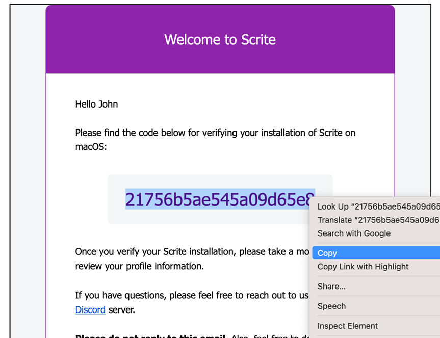
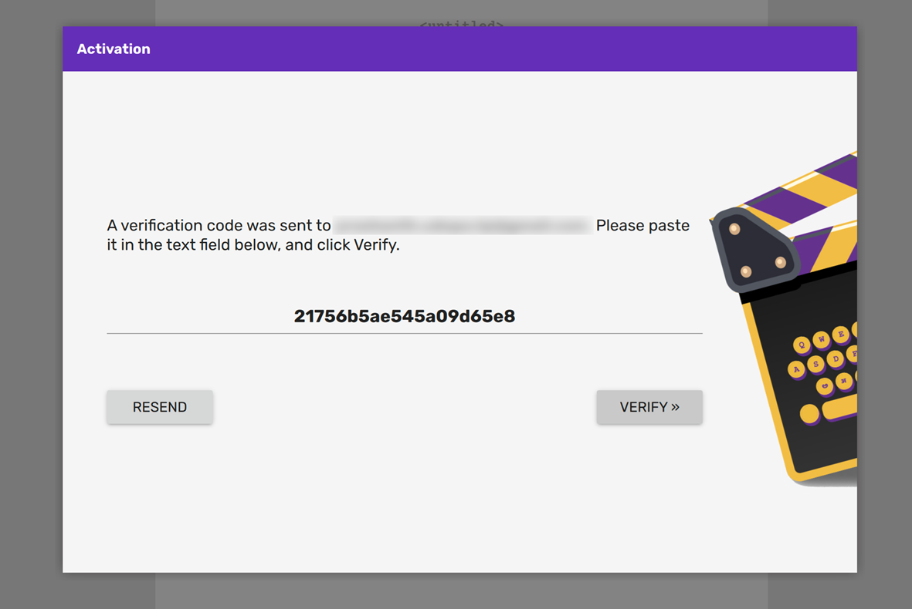
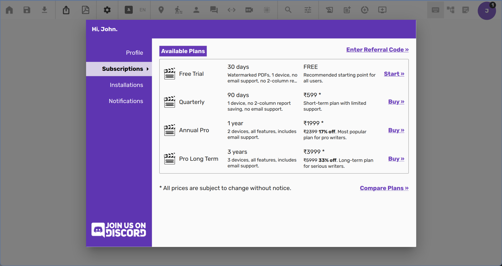
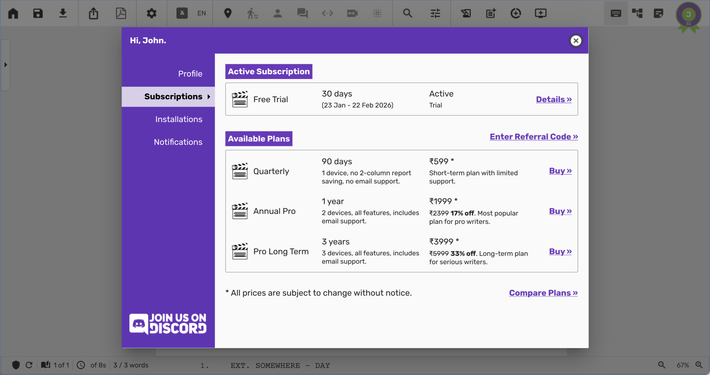

# Welcome to Scrite
Scrite is an open‑source desktop screenwriting app for Windows, macOS, and Linux. Write in multiple
languages, export industry‑standard PDFs, and generate reports—all with tools that suit beginners
and professionals alike.

## Scene‑Centric Approach
Most apps treat a screenplay as pages; Scrite treats it as scenes—because that’s how films are made.
Instead of page counts, Scrite helps you structure and visualize your story with a structure-first
scene‑centric UI.

## Why Scenes First?
Traditional screenwriting apps mirror typewriters: one page ≈ one minute. Page count still matters,
but filmmakers think in scenes. Scrite shifts the focus to building your story scene by scene—making
structure clearer, relationships easier to see, and navigation more natural.

Scrite supports industry formatting while encouraging a scene‑first mindset.

| Page‑Centric Apps	| Scrite’s Scene‑Centric Approach| 
|:------------------|:-------------------------------|
| Think in pages | Think in scenes | 
| Screenplay length = page count | Screenplay length = scene flow | 
| Mimics typewriters | Mimics filmmaking structure | 
| Formatting = aligned with industry standard | Formatting = aligned with industry standard | 
| Navigation = scroll through pages | Navigation = jump between scenes | 

## What Scrite Is Not
To set expectations clearly, here’s what Scrite does not aim to be.

### Page‑Centric ✗
Scrite isn’t a clone of Final Draft, Celtx, or Arc Studio. It doesn’t mimic the typewriter‑inspired,
page‑centric approach. Scrite reimagines writing by using scenes as the fundamental unit of
storytelling.

> **NOTE**: Scrite does calculate page count, estimates screentime, and displays approxmate page
> boundaries. However, it is not designed to be a page-centric editor.

### Cloud Storage ✗
Scrite saves files locally on your computer. We don’t store your work on our servers, so backups are
your responsibility. We can’t recover lost or deleted files—use a cloud‑synced folder (Dropbox,
Google Drive, etc.) to keep your work safe.

> In the future, we plan to add built-in integrations for popular cloud storage services like Google
> Drive and OneDrive. Until then, you can use the folder-sync features provided by these platforms
> to keep your documents synced across multiple devices.

### Real‑Time Collaboration ✗
Scrite doesn’t support multiple writers editing the same document simultaneously. The app warns when
a file is opened on more than one device, but safeguards aren’t foolproof. Concurrent editing may
cause conflicts or data loss.

> Real-time collaboration is planned for a future update.

### Dark Mode ✗
Dark mode is one of our most‑requested features. We appreciate how helpful it is and plan to add it.
For now, Scrite doesn’t include a dark theme, and we apologise if this is a deal breaker for you.

### AI Copilot ✗
Scrite doesn’t include built‑in AI features today. If you prefer an AI copilot, you can use tools
like ChatGPT, Claude, Grok, or Gemini alongside Scrite.

We’re exploring AI‑enabled workflows that respect your creative voice. When they’re ready, we’ll
announce them on our website and in this guide. 

### Production Planning Tools ✗
Right now, Scrite focuses on writing. We’re assembling a team to build production planning features
thoughtfully.

Planned areas include:

- Shot division
- Storyboarding
- Scheduling
- Call sheets
- Budgeting
- Customizable reports
- Production tracking
- Companion apps for mobile and tablets

We also intend to offer AI assists that support these workflows—without getting in the way of your
creative process. 

## Supported Platforms
Scrite is a desktop app for Windows, macOS, and Linux.

> As of writing Scrite is not available for tablets and mobile phones, though we would like to
support them at some point in the future.

### Minimum Requirements
- Operating System - Windows 10 or later - Scrite may run on Windows 7/8.1, but it’s not actively
        tested. - If installation fails or the app won’t start (DLL errors), install Windows Updates
                and then reinstall Scrite.
    - macOS High Sierra 10.13 or later
        - Intel x86_64 builds available
        - Native Apple Silicon builds not yet available
    - GNU/Linux
        - Ubuntu 22.04 or later
        - X11 or Wayland
- Hardware
    - Display Resolution: 1280×768 or higher recommended
    - RAM: 8 GB
    - Any Intel processor with 2 cores or more
    - Graphics Card with 16MB or more VRAM would is recommended, although not absolutely required

The best way to check if Scrite works for you is to install it and use the free trial for a couple
of weeks.

## Installing Scrite
Download the installer for your OS from the [Downloads](https://www.scrite.io/downloads) page.

> **Note:** Review installation instructions on the Downloads page for Windows, macOS, and Linux.

## Subscription Options
On first launch, create a Scrite account and activate the 30‑day free trial—or sign up for a paid
plan.

> **Note:** Without an active subscription (trial or paid), the app is locked.

### Create Your Scrite Account
On first launch, set up your login using your email address.

> **Note:** Your Scrite account manages trials and subscriptions. It doesn’t sync documents or
> settings across devices.

Click “Continue” and you’ll receive an activation code by email.

Copy the code and paste it into Scrite.

Once verified, Scrite issues license tokens and unlocks the app.

License tokens renew automatically as long as you’re online and use Scrite at least once every 28
days. If the app can’t connect within that window, it locks and prompts you to reactivate.

### Start a 30‑Day Free Trial
Try all features and ensure Scrite works on your devices. Click “Start” next to Free Trial—no credit
card required. You can import from other formats and export Scrite documents to third‑party formats.

The following features are restricted during the free trial:

— PDF watermarks can’t be configured or removed. — Two‑Column Report can’t be saved to PDF. — No
email support. — Use of the app is limited to one device at a time (details later).

At any time during your trial, you can purchase a plan. Paid features unlock immediately for the
rest of your trial and for the duration of your plan.

Plans, prices, and currency vary by location. Film‑school students can email support@scrite.io for
discounted options.

### Purchase a Plan

After starting your trial, you can explore available plans or close the profile window and start
writing.

At any time, click the `User Account` icon (top‑right) to open the User Profile dialog. Switch to
the Subscriptions tab to view available plans.

Click `Compare Plans` (bottom‑right) to open a feature comparison table.

<screenshot>

Review features carefully before purchasing. Cancellation or upgrade isn’t currently offered.

When ready, click `Buy` on your chosen plan. Complete payment in the browser, then return to
Scrite—the plan activates immediately. If trial days remain, the app may still show “TRIAL”, but
paid features are available.

If you run into payment or activation issues, check the FAQ. For help, email support@scrite.io.

### Build from Source
Scrite is open source. Find the code on [GitHub](https://github.com/teriflix/scrite) and follow the
[README](https://github.com/teriflix/scrite/blob/master/README.md) for build instructions.

> **Note:** We don’t provide support for building Scrite or for unofficial builds.

